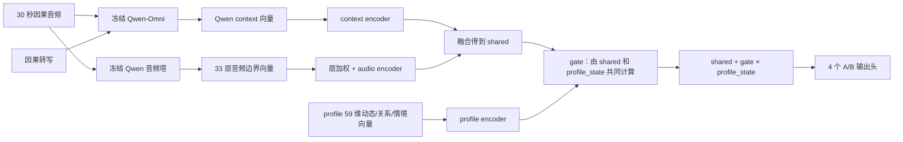
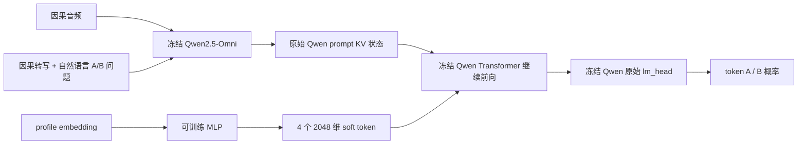

# Profile-Aware Turn-Taking：当前完整实验总结

## 1. 这份报告回答什么

本项目要回答的核心问题是：在预测下一步话轮行为时，除了当前语音和对话内容，正确的 profile 是否能帮助模型做出更好的判断？

当前实验采用 Talking Turns 的四个二分任务作为评测接口：Turn Change、Backchannel、Interruption、Floor-Taking Interruption。每个问题输出 `A` 或 `B` 的概率；论文式结果使用每个问题正负例相等的 50/50 测试子集 Accuracy。

本报告区分三件事情：

1. 纯音频是否已能达到合理的话轮判断水平；
2. 在同一模型中去掉转写或去掉 profile 后，结果怎样变化；
3. 真正将 profile 放进 Qwen Transformer 的 soft-prompt 方法是否已技术跑通。

## 2. Talking Turns 的监督模型是什么

来源：Arora et al., *Talking Turns: Benchmarking Audio Foundation Models on Turn-Taking Dynamics*, ICLR 2025，`2503.01174v1.pdf` 的 Section 4.1、Appendix A.4、Figure 7、Equation 9 和 Table 4。

论文的 supervised topline 不是提示词模型，也不是 SFT 一个大语言模型。它是一个专门训练的话轮分类器：


它的训练单位是因果 40 ms chunk：模型只看第 `i-1` 个 chunk 及以前的音频，预测下一个 40 ms chunk 的话轮标签。论文明确写明：chunk 大小是 40 ms、上下文窗口是 30 秒、声学 encoder 是 Whisper-medium、所有 encoder 隐藏层加权、取最后音频帧后接线性层和 softmax，整体使用 cross-entropy 训练。

Table 4 的 Supervised Topline Accuracy：

| 任务 | Accuracy |
|---|---:|
| Turn Change | 78.6% |
| Backchannel | 75.1% |
| Interruption | 74.9% |
| Floor-Taking Interruption | 65.6% |
| 四项平均 | 73.55% |

论文用五类概率推导四个 A/B 问题。例如 Turn Change 比较 continuation 与 turn change；Backchannel 比较无 BC 与 BC；Interruption 比较无 interruption 与 interruption；Floor-Taking 比较重叠后原说话人是否继续持有话轮。

## 3. 我们的数据如何重新处理

### 3.1 原始语料和统一格式

我们使用 SBCSAE 的 16 段核心双人会话，合计约 6.43 小时。每段原始 WAV 与 `.trn` 转写被解析；说话人映射为 `speaker_00 / speaker_01`。双声道语音使用相位安全混音转成 16 kHz 单声道，避免简单左右平均抵消声音。

### 3.2 五类自动标签

每 40 ms 给出唯一标签，规则优先级为 `NA > BC > I > T > C`：

- `NA`：VAD 静音；
- `BC`：短回应词（如 *um / yeah / right*）对应的有声段；
- `I`：两个说话人的有效重叠至少 40 ms；
- `T`：没有有效重叠的新说话人开始，只标开始所在第一个 40 ms；
- `C`：其他有声持续段。

得到 578,686 个 40 ms 五分类标签：

| C | BC | T | I | NA |
|---:|---:|---:|---:|---:|
| 346,016 | 14,041 | 1,358 | 26,188 | 191,083 |

当前训练标签是自动规则标签；本报告不将其表述为人工金标。

### 3.3 用于当前 Qwen A/B 实验的样本

从事件候选中保留有完整 30 秒历史、且满足四个 A/B 任务定义的样本。每条记录包含：

```text
预测边界前 30 秒单声道音频
+ 边界前已完成的转写单元（因果转写）
+ profile（仅在 given/shuffled 条件中不同）
→ 预测 t+100 ms 到 t+600 ms 内对应的 A/B 结果
```

| split | 样本数 | C | BC | T | I | NA |
|---|---:|---:|---:|---:|---:|---:|
| train | 6,623 | 2,474 | 455 | 891 | 424 | 2,379 |
| validation | 2,243 | 788 | 158 | 365 | 112 | 820 |
| test | 1,938 | 733 | 117 | 260 | 93 | 735 |

数据审计保证：30 秒窗口均终止于预测边界；转写只含边界前已完成单元；模型请求不含未来音频、未来转写、真实标签或标注解释。`hidden/given/shuffled` 对照中，音频、样本 ID、预测边界、转写、问题和解码设置保持不变，只改 profile。

## 4. 我们的三个模型结构

### A. 纯音频基线：与 Talking Turns 尽量对齐


这里的音频模块不是模糊的“Qwen 音频功能”。代码中直接 import：

```python
from transformers.models.qwen2_5_omni.modeling_qwen2_5_omni import Qwen2_5OmniAudioEncoder
```

并且只读取权重名以 `thinker.audio_tower.` 开头的参数。该模型没有转写、没有 profile，因此它是音频能力基线，不是 profile 验证。

### B. cached-feature adapter：音频＋因果转写＋profile



训练的可更新参数是：音频层权重、context/audio/profile 投影、gate 和四个 A/B 输出头。Qwen 只负责生成冻结向量，不在这一步反向更新。

三种测试条件：

| 条件 | 音频 | 转写 | profile |
|---|---|---|---|
| hidden | 相同 | 相同 | 全零 |
| given | 相同 | 相同 | 正确 profile |
| shuffled | 相同 | 相同 | 错误会话 profile |

### C. 同一 cached-feature adapter 的输入消融：音频＋profile、转写置零

**B 和 C 是同一个 adapter 类，不是两个不同模型。**二者都使用同一份 `SharedBinaryMultiHeadAdapter` 代码、同一种音频层加权、同一个 profile encoder、同一种 gate 和同样四个 A/B 输出头；训练超参数、split 和 profile 对照规则也相同。C 只是将 B 的 Qwen context/转写分支关闭、重新训练剩余参数，以保证模型不会从转写向量中获得信息。这是输入消融，而非新模型。


| 条件 | 音频 | 转写 | profile |
|---|---|---|---|
| hidden | 相同 | 全部置零/不输入 | 全零 |
| given | 相同 | 全部置零/不输入 | 正确 profile |
| shuffled | 相同 | 全部置零/不输入 | 错误 profile |

这条消融直接回答：没有文字转写时，profile 本身能否帮助音频话轮判断？

### D. 真正进入 Qwen 的 soft-prompt adapter（已技术跑通）



它的优势是 profile 真正通过 Qwen Transformer 的注意力层影响 A/B 输出；关闭 adapter 时直接调用原始 Qwen，因此普通 Qwen 功能不被改变。目前只完成 8 条训练样本的技术 pilot，尚不是正式 profile 效果实验。

## 5. 当前结果

### 5.1 四任务平均结果

| 输入/条件 | 普通 Accuracy | 论文式 50/50 平衡 Accuracy | 解释 |
|---|---:|---:|---|
| A：audio only | 76.58% | **73.55%** | 音频能力基线 |
| B：audio + transcript，profile hidden | 78.10% | **74.01%** | 去掉 profile 的带转写模型 |
| B：audio + transcript，profile given | **78.53%** | 73.83% | 正确 profile |
| B：audio + transcript，profile shuffled | 78.32% | **74.14%** | 错误 profile |
| C：audio only + profile hidden | 76.78% | 72.98% | 转写置零 |
| C：audio only + profile given | 77.08% | 72.83% | 转写置零、正确 profile |
| C：audio only + profile shuffled | **77.44%** | **73.02%** | 转写置零、错误 profile |

### 5.2 如何解释

1. 纯音频模型的 73.55% 与 Talking Turns Table 4 的四项平均数相同，说明本地的“30 秒音频→四个 A/B”训练管线可以达到合理水平。由于数据集、标签构造和音频 encoder 不相同，不能写成超过论文 SOTA。
2. 加因果转写后，hidden 的平衡 Accuracy 从 73.55% 到 74.01%，只有约 0.46 个百分点；它不是大幅提升，但转写没有造成明显退化。
3. profile 的正确版本在两种输入设置下都没有稳定超过 hidden 和 shuffled。尤其转写置零时，shuffled 的结果略高于 given。此时 profile 还不能被解释为模型可靠使用的证据。
4. 所以**目前不建议仅仅为了“audio＋profile 无转写”再发明一个新 MLP 结构**：同一个 adapter 的对应消融已验证，问题不在于我们漏了这个输入组合。更可能的瓶颈是当前 profile 的样本差异/训练监督不足，或 profile 对未来短时间话轮本来只提供很弱的先验。
5. 下一步更有价值的是扩大真正 Qwen soft-prompt adapter 的正式训练，或改进 profile 的动态行为信息与训练目标；再以 `given > hidden` 且 `given > shuffled` 为唯一成功标准。

## 6. 文件位置

- Talking Turns 原文：`C:/Users/xiong/Desktop/2503.01174v1.pdf`
- 标签重处理报告：`code/reports/FORCED_VAD_FIVECLASS_LABELS_ZH.md`
- 当前 30 秒请求数据审计：`data/processed/sbcsae_qwen_shared_ab_30s_causal_v1/summary.json`
- 带转写 profile adapter 结果：`artifacts/qwen-shared-ab-30s-causal/paper-aligned-floor/history120-floorprop-profile-margin-final/gate_profile_margin_0p25/summary.json`
- 转写置零 profile adapter 结果：`artifacts/qwen-audio-profile-no-transcript-ab/paper-aligned-gate-v1/summary.json`
- 纯音频结果：`artifacts/qwen-audio-only-ab-baseline/paper-aligned-v1/summary.json`
- soft-prompt pilot：`artifacts/qwen-soft-prompt-adapter/pilot-1-per-class/summary.json`
