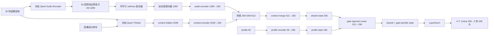

# Profile-Aware Turn-Taking：参考论文梳理、主方法与正式实验方案

> 写作目标：以 *Talking Turns*（ICLR 2025）为主要参照，完整理解它如何提出问题、设计方法、组织实验并形成结论；在此基础上，确定我们论文的主方法与正式实验。
>
> 本文档把我们当前表现最好的 **Qwen shared gated A/B adapter** 作为主方法。Soft prompt 不属于当前主方法，只在最后作为未来工作简要提及。

---

## 一、先理解 Talking Turns 到底是一篇什么论文

论文：Arora et al., *Talking Turns: Benchmarking Audio Foundation Models on Turn-Taking Dynamics*, ICLR 2025。

这篇论文不是单纯训练一个分类器，也不是只做 Table 4 的四个 A/B 问题。它的完整研究逻辑是：

```text
现有语音系统已经能对话
        ↓
但“说了多少、沉默多久、重叠多少”只能描述现象
        ↓
不能判断一次接话、反馈或打断发生得是否合适
        ↓
作者训练一个因果 turn-taking judge
        ↓
用 judge 的五类概率定义五种 timing-centric 指标
        ↓
评测真实人机对话中的 Moshi 和级联系统
        ↓
再单独测试多个音频大模型能否理解和预测话轮事件
```

所以它的核心贡献是一个**以时间点为中心的评测协议**：不仅统计某类行为发生了多少次，还判断它是否在合适的时机发生。

---

## 二、按 Talking Turns 的文章结构完整梳理

## 1. Introduction：论文先提出什么问题

作者首先指出，语音对话不是“用户说完一句、系统再答一句”的严格轮流过程。自然对话包括：

- 说话人继续持有话轮；
- 听者在合适时机给出 backchannel；
- 双方出现自然重叠；
- 一方打断并抢到话轮；
- 一方被打断后让出或保持话轮；
- 双方根据停顿和语调判断什么时候可以开始说。

已有语音系统可能是全双工端到端模型，也可能是 `VAD → ASR → LLM → TTS` 的级联系统。两者都能产生语音，但“能产生连续语音”不等于“理解话轮时机”。

作者认为，仅使用平均轮长、静音比例、重叠比例等 corpus-level statistics 不够，因为它们不能回答：

```text
这次 backchannel 是否发生在合理的位置？
这次打断是协作性的，还是突兀、粗鲁的？
用户暂停时，系统应当接话还是继续等待？
用户打断系统后，系统是否应当让出话轮？
```

论文因此提出三个层次的贡献：

1. 建立 timing-centric turn-taking 评测协议；
2. 用该协议分析现有语音系统真实人机对话中的问题；
3. 建立音频基础模型理解/预测 turn-taking 的测试集。

### 对科研写作的启发

Introduction 不是从模型结构开始，而是先证明“现有评价方式回答不了这个问题”。只有缺口被讲清楚，后面的 judge 和实验才显得必要。

---

## 2. Related Study：作者把自己放在什么位置

论文回顾了四类相关工作：

1. Turn change / end-of-turn prediction；
2. Backchannel prediction；
3. Interruption detection and prediction；
4. 能够实时双向生成的 audio foundation models。

已有研究可以预测某些事件，也有 VAP 等模型预测未来说话活动；但作者认为，尚缺少一种面向真实人机语音系统、能够同时分析接话、backchannel、打断、让出话轮和时机合理性的统一协议。

### 对科研写作的启发

Related Work 不是简单罗列论文，而是用来建立边界：别人解决了什么，我们多解决哪一步。

---

## 3. Conventional Corpus-Level Statistics：先展示传统方法及其不足

### 3.1 真实人机对话数据

作者让参与者分别与两类系统对话：

- Moshi：端到端双工语音系统；
- Cascaded system：Silero VAD、Whisper、SmolLM 和 MeloTTS 组成的传统流水线。

每个系统约收集 4 小时对话，11 位参与者，每次会话约 5 分钟。

### 3.2 先定义基础话轮事件

论文把对话划成连续小时间块，用两位说话人的语音活动定义：

| 概念 | 定义 |
|---|---|
| IPU | 一段连续语音，两侧由超过 200 ms 的静音分隔 |
| Silence | 两人都不说话 |
| Pause | 同一说话人的两个 IPU 之间的静音 |
| Gap | 不同说话人的两个 IPU 之间的静音，即换人前静音 |
| Overlap | 两位说话人同时有语音 |
| Backchannel | 听者发出的简短回应，但不夺取当前话轮 |
| Interruption | 两人重叠且都在争取话轮 |
| Floor-taking interruption | 插入者最终持续说下去并取得话轮 |
| Butting-in | 插入者未取得话轮，原说话人继续 |

这里最重要的逻辑是：

```text
Overlap 只是声学现象；
BC 与 I 还需要判断听者行为的功能；
Floor-taking 还需要观察重叠之后谁最终继续说。
```

### 3.3 传统 corpus-level statistics 做了什么

作者统计平均轮长、静音、重叠、说话速度等整体数据。它们能够发现系统与人类在总体行为频率上不同，但不能判断每一次行为发生得是否合适。

例如，两个系统可能有相似的重叠比例，但一个系统是在用户犹豫时自然补充，另一个系统总是在用户句子中间突然插话。单看“重叠占比”无法区分。

### 对科研写作的启发

这是很典型的铺垫实验：先运行现有方法，再用其不足说明新方法为什么有必要。论文不是一开始就宣布自己的指标更好，而是让读者先看到旧指标遗漏了什么。

---

## 4. Timing-Centric Metrics：论文真正的方法部分

## 4.1 Supervised turn-taking judge

作者训练一个因果五分类模型。输入是当前时间点以前的单声道混合音频，输出下一 40 ms 时间格的五类概率：

```text
C   当前话轮继续
BC  听者 backchannel
T   发生话轮转换
I   发生 interruption
NA  无人说话
```

模型结构：


训练时使用交叉熵。模型只看 `i-1` 以前的音频，预测第 `i` 个 40 ms chunk，因此它是因果预测，不偷看未来。

### 为什么模型要这样设计

- Whisper 已经从大量语音中学习了音素、语调、语义和说话风格；
- 不同 encoder 层包含不同层次的声学/语义信息，因此让模型学习层权重，而不是只固定使用最后一层；
- 取预测边界处的最后时间帧，是因为任务要判断“截至当前这一刻，下一步将发生什么”；
- 线性输出头足够直接，可以检验 Whisper 表示是否包含话轮信息。

### Table 1 在证明什么

Table 1 报告五类事件的 ROC-AUC，并在 Switchboard、Columbia Games、Fisher 等数据上测试。它不是论文最后的系统比较，而是在回答：

> 这个 judge 自己是否足够可靠，能不能作为后续自动评测的基础？

作者发现模型在多类事件和 OOD 语料上保持较高 ROC-AUC，因此认为它可以作为人工相关性判断的近似代理。

## 4.2 五种核心对话能力

作者没有直接用 `argmax` 五分类去打分所有系统，而是用五类概率构造五个 timing-centric 问题。

### Metric A：用户说话时，系统什么时候应该接话

在用户暂停的位置比较：

```text
P(T) - P(C)
```

如果换人概率明显高于继续概率，judge 认为系统应当接话；否则应继续等待用户。

### Metric B：用户说话时，系统什么时候应该 backchannel

根据 `P(BC)` 判断当前位置是否适合短反馈。

### Metric C：用户说话时，系统什么时候应该 interrupt

比较 `P(I) - P(C)`，判断另一方此时插入是否自然。

### Metric D：系统说话时，是否清楚表达“我还要继续”或“你可以接话”

当系统暂停时，仍比较 `P(T)` 与 `P(C)`，检查人类是否能从系统的说话方式中得到正确的话轮信号。

### Metric E：用户已经打断系统后，系统是否应该让出话轮

在已经观察到 interruption 后比较 `P(T) - P(C)`。如果 `T` 更高，系统应让用户取得话轮；如果 `C` 更高，系统继续保持话轮。

这就是 Floor-Taking 问题的真正位置：它不是“有没有重叠”，而是“重叠发生以后谁最终持有话轮”。

## 4.3 为什么还要与人类行为对齐

自动 judge 不能因为模型分数高就自动被相信。作者在真实人类对话中把人类实际做出的决定当作近似人工判断，然后检查 judge 是否与人类行为一致，并在验证集上选择各指标阈值。

这一步形成完整论证：

```text
judge 五分类性能较好
        +
judge 的时机判断与人类行为有较高一致性
        ↓
judge 可以用来分析 AI 的话轮行为
```

## 4.4–4.8 对 Moshi 和级联系统的分析

作者不是只给一个总分，而是逐能力分析：

- 系统是否在用户让出话轮时及时接话；
- 系统是否在合适位置 backchannel；
- 系统的 interruption 是否自然；
- 系统是否能通过自己的语音提示用户它还想继续；
- 用户打断后系统是否能适当让出话轮。

论文发现，现有系统可能说得很多、重叠也不少，但这不代表时机正确。例如，Moshi 的打断有时过于激进，系统很少 backchannel；传统级联系统的部分打断来自 VAD 错误。

### Figure 3 与 Table 2 的分工

- Table 2：某类行为发生了多少次；
- Figure 3：这些行为与 judge 认为的合理时机有多一致。

这是论文实验设计中非常值得学习的一点：**频率和质量分开测**。行为发生得多，不等于发生得对。

## 4.9 Single-label evaluation

作者还分析了把 judge 简化成单一标签判断时的表现与误差，说明自动评测仍有局限。好论文不会只展示有利结果，也会说明指标在哪些情形下不可靠。

---

## 5. Additional Evaluation：普通音频大模型能否理解和预测 turn-taking

这一节才是我们之前反复讨论的 Table 3 和 Table 4。

### Table 3：Understand 已发生的事件

模型看到截至事件发生后的音频，回答音频中是否已经出现 Turn Change、Backchannel 或 Interruption。

这是“识别已经发生的事件”，不是未来预测。每个任务正负样本相等，随机 Accuracy 为 50%。作者用正常的音频 prompt 让 SALMONN、Qwen-Audio 和 Whisper+GPT-4o 回答 Yes/No 或 A/B。

### Table 4：Predict 未来的事件

模型只看到第 `i-1` 个 chunk 以前的音频，需要预测第 `i` 个事件。四项任务是：

| 任务 | 问题 |
|---|---|
| Turn Change | 当前人继续，还是对方开始接话？ |
| Backchannel | 接下来是否出现短反馈？ |
| Interruption | 接下来是否发生打断？ |
| Floor-Taking | 已有打断之后，插入者是否成功取得话轮？ |

论文测试集对每个任务保持正负样本相等。Supervised Topline 的四项 Accuracy 为：

| Turn Change | Backchannel | Interruption | Floor-Taking | 平均 |
|---:|---:|---:|---:|---:|
| 78.6 | 75.1 | 74.9 | 65.6 | 73.55 |

开放音频大模型大多接近 50%。Whisper+GPT-4o 在 Turn Change 上达到 62.2%，但在 BC、I 和 Floor-Taking 上仍接近随机。

### Table 3 与 Table 4 为什么都需要

```text
Table 3 低：模型连已经发生的事件都识别不清；
Table 3 高、Table 4 低：模型能事后识别，但不会提前预测；
两者都高：模型既理解事件，也能利用前兆做因果预测。
```

这就是一个清晰的实验分解：作者不把所有失败混成一个数字，而是判断失败发生在“理解”还是“预测”。

---

## 6. Discussion and Limitations：作者最后怎样收束

论文结论不是“某模型最好”，而是：

1. 传统统计不能充分评价话轮时机；
2. 监督 judge 可以提供可扩展的 timing-centric 指标；
3. 当前语音系统在接话、backchannel、interruption 和 floor handling 上仍有明显不足；
4. 普通音频基础模型对未来话轮事件的预测大多接近随机；
5. 自动 judge 依赖监督数据、标签规则和阈值，不能被视为完美人工评价替代品。

### 一句话总结 Talking Turns 的实验逻辑

> 先证明传统统计不够，再训练并验证一个因果 judge，然后用 judge 分析真实对话时机，最后用独立平衡 benchmark 测试普通音频模型能否理解和预测相同事件。

---

## 三、PAChat 对我们的辅助启发

PAChat 的重点是多人物个性化回复生成，而不是 turn-taking。它将语音语义、说话人身份、profile 和对话历史作为不同信息来源：

```text
Whisper + Q-Former：语音内容
Speaker Encoder：说话人身份
Profile：人物背景
Dialogue History：上下文
Llama：生成个性化回复
```

它对我们的主要启发只有两点：

1. 不同模态应有各自明确的编码分支，再进行融合；
2. 可以冻结大模型，只训练轻量对齐/融合模块，以降低训练成本。

我们的任务不同：PAChat 生成个性化回复；我们预测下一步话轮事件。因此 PAChat 是架构思想参考，不是我们的直接实验模板。

---

# 四、我们的主方法：Qwen Shared Gated A/B Adapter

## 1. 方法要解决什么

我们的目标是利用冻结 Qwen 提取的多模态表示，训练一个轻量 turn-taking adapter：

```text
预测边界前因果音频
+ 匹配的因果部分转写
+ 当前用户/关系/情境 profile
        ↓
预测四个 Talking Turns 风格 A/B 任务
```

当前表现最好的配置是：

```text
Frozen Qwen multi-layer audio representation
+ Frozen Qwen audio-transcript context representation
+ 59-dimensional dynamic/relationship/situation profile
+ shared gated residual fusion
+ four task-specific A/B heads
```

## 2. 完整结构



数学形式：

```text
a = AudioEncoder(Σ_l softmax(α)_l · h_audio^l(t))
c = ContextEncoder(h_qwen(audio≤t, transcript≤t))
s = ContextMerge([a ; c])
p = ProfileEncoder(profile_t)
g = sigmoid(W_g [s ; p] + b_g)
z = LayerNorm(s + g ⊙ p)
y_k = Softmax(W_k z + b_k),  k ∈ {T, BC, I, Floor}
```

其中 Qwen 主体冻结，训练音频层权重、投影层、融合层、profile encoder、gate 和四个 A/B 头。

---

## 3. 为什么采用这个架构：每一个模块的必要性

这部分是论文 Method 的核心。不能只写“我们用了 gate”，必须解释该结构针对什么困难。

### 3.1 多层音频表示：同时保留低层声学与高层语义线索

Turn-taking 依赖多种层次的信息：低层的音量、停顿、语调、重叠和呼吸；中层的音素与韵律；高层的句子完成度、意图和上下文。

Qwen 音频 encoder 不同层侧重不同信息。若只取最后一层，可能丢掉细粒度声学边界；若人工固定某一层，又缺少依据。因此我们从卷积输入层和 32 个 encoder 层分别取预测边界处的表示，通过 softmax 学习 33 个层权重。

架构优势：

1. 模型可以按 turn-taking 任务自动选择有用层；
2. 同时利用细粒度声学和抽象语义；
3. 与 Talking Turns 的“所有 Whisper encoder 层可学习加权”有清楚的研究继承关系。

### 3.2 音频边界分支与上下文分支分开：时间证据和语义证据互补

音频分支关注预测边界处发生了什么，例如停顿、拖音和重叠趋势；Qwen Thinker 的 context hidden 同时编码音频与因果转写，更适合表示前文语义、句法完成度和对话内容。

如果只保留 context hidden，细小的声学边界可能被长上下文压缩；如果只保留音频边界，模型可能不知道当前句子语义上是否已经结束。

因此两条分支先各自编码到 256 维，再拼接并通过 `context_merge` 形成 shared state。

架构优势：

1. audio branch 负责局部时机，context branch 负责全局语义；
2. 避免在原始不同维度空间直接相加；
3. 模型可以学习两种证据的非线性组合，而不是人工指定固定比例。

### 3.3 统一投影到 256 维：任务空间对齐

原始表示维度不同：audio 是 1280，context 是 2048，profile 是 59。它们不能直接相加或比较。

三个 encoder 分支把信息映射到同一个 256 维任务空间。每个输出维度都是原始信息的可学习组合，并由 turn-taking 交叉熵监督。

架构优势：

1. 解决不同表示空间和量纲不一致；
2. 大幅减少后续融合与分类参数；
3. 在仅有数千训练样本时降低过拟合风险；
4. 保持三条分支模块化，便于消融和替换。

### 3.4 Late fusion：先形成可靠 shared 判断，再让 profile 调节

音频和转写提供当前事件的直接证据；profile 更多提供先验，例如某位用户通常停顿较长、较常 backchannel，或当前关系/情境更正式。

如果一开始就把 profile 与原始音频全部拼在一起，模型可能过度依赖会话身份，甚至用 profile 记住标签分布。我们先从音频与转写形成 `shared`，再让 profile 做后期修正。

架构优势：

1. 保留一个不依赖 profile 的基础判断路径；
2. profile 只能调节而不能完全替换当前语音证据；
3. hidden/given/shuffled 对照更容易解释。

### 3.5 Gated residual fusion：对每条样本、每个维度动态决定 profile 影响

Gate 的计算是：

```text
g = sigmoid(W_g [shared ; profile_state] + b_g)
```

`shared` 和 `profile_state` 都是 256 维，拼接后是 512 维。线性层输出 256 个值，sigmoid 将每个值限制在 0–1。

最终融合：

```text
z = shared + g ⊙ profile_state
```

它不是一个全局固定权重。因为 `g` 同时由当前对话状态和当前 profile 决定，所以不同样本、不同表示维度都会得到不同权重。

例如：

- 当前音频边界非常明确时，模型可以减小 profile 修正；
- 当前停顿既可能是思考也可能是让出话轮时，关系和个人历史可能获得更大权重；
- profile 某些维度与当前情境不相关时，对应 gate 可以接近 0。

Residual 路径 `shared + ...` 的意义是：即使 profile 没有帮助，基础音频/转写表示仍然完整保留，模型不必重新构建全部判断。

架构优势：

1. 样本级动态性：不同事件使用不同 profile 强度；
2. 维度级选择性：不是一个标量控制全部 profile；
3. 安全退化：gate 较小时接近无 profile 模型；
4. 更好的优化路径：残差使梯度可以直接流向 shared 分支；
5. profile 是调节因素，而不是当前声学证据的替代品。

### 3.6 Shared multi-task trunk + 四个 A/B 头：共享规律，保留任务差异

四个任务都依赖同一段对话状态，但决策边界不同。完全训练四个独立模型会重复学习相同规律；完全使用一个二分类头，又无法表达任务差异。

因此我们共享前面的音频、context、profile 和 gate，只在最后使用四个独立的 `Linear(256,2)` 输出头。

架构优势：

1. 多任务共享提高数据利用率；
2. 四个头保留各任务不同的分类边界；
3. 单个 checkpoint 可以统一评测四种行为；
4. 方便报告逐任务结果和平均结果。

### 3.7 冻结 Qwen，只训练轻量模块：计算效率与稳定性

我们的数据规模不足以从头训练大型音频语言模型。冻结 Qwen 能够：

1. 利用其预训练声学与语言知识；
2. 大幅减少显存与训练时间；
3. 降低小数据破坏预训练能力的风险；
4. 使不同 profile 条件共用相同 backbone，保证比较公平；
5. 让研究贡献集中在 profile-aware fusion，而不是大规模预训练资源。

这个设计与 PAChat 冻结大模型、训练轻量对齐模块的思想相似，但我们的输出和任务不同。

---

## 4. 我们的方法在论文里应该怎样概括

可以使用下面这段作为 Method 开头的底稿：

> We propose a profile-aware multi-task turn-taking adapter built on frozen representations from Qwen2.5-Omni. The model separately encodes multi-layer acoustic evidence at the prediction boundary and multimodal dialogue context from causal audio and partial transcripts. These representations are projected into a shared turn-taking state. A structured dynamic profile is encoded by a dedicated branch and injected through gated residual modulation, allowing profile information to adjust—but not replace—the evidence from the ongoing conversation. A shared fusion trunk supports four task-specific binary heads for turn change, backchannel, interruption, and floor-taking prediction.

这段话的顺序是：基于什么模型 → 三种输入怎样表示 → 怎样融合 → profile 怎样起作用 → 输出什么任务。

---

# 五、我们的正式实验应该怎样确定

## 1. 主研究问题

```text
RQ1：我们的 Qwen adapter 能否有效预测四种未来 turn-taking 事件？
RQ2：正确 profile 是否优于不提供 profile？
RQ3：正确 profile 是否优于错误/打乱 profile，证明模型使用的是匹配信息？
RQ4：动态行为 profile、关系和情境分别贡献什么？
```

## 2. 必要 baseline

| 方法 | 作用 |
|---|---|
| Random 50% | Talking Turns 平衡二分类下界 |
| Talking Turns 官方 ESPnet checkpoint | 外部监督音频模型，在同一 SBCSAE 测试数据上运行 |
| Qwen audio-only A/B | 检验多层音频分支本身 |
| Qwen audio + transcript, no profile | 主方法的 hidden baseline |
| Direct profile concatenation | 验证 gate 是否优于最简单融合 |
| Ours gated profile adapter | 主方法 |

PAChat 不应作为数值 baseline，因为任务、数据和输出完全不同；它只作为 persona-aware 架构参考。

## 3. Profile 的三组核心对照

| 条件 | 音频 | 因果转写 | Profile |
|---|---|---|---|
| hidden | 相同 | 相同 | 全零/隐藏 |
| given | 相同 | 相同 | 当前样本正确 profile |
| shuffled | 相同 | 相同 | 其他会话错误 profile |

三组之间只能改变 profile。样本 ID、预测边界、音频、转写、标签、任务和解码设置必须完全相同。

## 4. 正式任务与标签

主评测采用 Talking Turns 风格的四个 A/B 任务：

| 任务 | A | B |
|---|---|---|
| Turn Change | 当前人继续 | 对方开始接话 |
| Backchannel | 不出现 BC | 出现 BC |
| Interruption | 不发生打断 | 发生打断 |
| Floor-Taking | 原说话人保持话轮 | 插入者取得话轮 |

必须注意：Floor-Taking 不能只用五分类 `C/T` 字符串代替。正式 manifest 中需要独立保存“已发生重叠以后，谁最终取得话轮”的标签，并可追溯到双方 IPU 时间戳。

五分类 `C/BC/T/I/NA` 可以作为辅助实验，报告 Macro-F1 和每类结果，但不能机械地把所有五类样本直接转换成四任务 benchmark。

## 5. 主指标

为了与 Talking Turns 对齐，主指标使用每任务 A/B 各 50% 的 Accuracy：

| 指标 | 用途 |
|---|---|
| Paper-balanced Accuracy | 四任务主结果，随机值 50% |
| 四任务平均 Accuracy | 总体能力摘要 |
| 每任务 Accuracy | 判断提升来自哪类事件 |
| Balanced Accuracy / Macro-F1 | 补充类别稳健性 |
| 会话级 bootstrap 95% CI | 判断提升是否稳定 |
| given-hidden / given-shuffled | profile 真实作用的直接证据 |

普通自然类别比例 Accuracy 可以放附录，但不能拿它直接与 Talking Turns 的 50/50 Table 4 比较。

## 6. 主结果表

| 方法 | Turn Change | Backchannel | Interruption | Floor-Taking | 平均 |
|---|---:|---:|---:|---:|---:|
| Random | 50.0 | 50.0 | 50.0 | 50.0 | 50.0 |
| Talking Turns checkpoint |  |  |  |  |  |
| Qwen audio-only |  |  |  |  |  |
| Ours hidden |  |  |  |  |  |
| Ours given |  |  |  |  |  |
| Ours shuffled |  |  |  |  |  |

Profile 效应另做一张表：

| 条件 | 平均 | given-hidden | given-shuffled |
|---|---:|---:|---:|
| hidden |  | — | — |
| given |  |  |  |
| shuffled |  | — | — |

## 7. 架构消融

| 消融 | 要证明什么 |
|---|---|
| 只取 Qwen 音频最后一层 vs 33 层加权 | 多层表示是否必要 |
| 仅 audio branch | context 语义是否必要 |
| 仅 context branch | 独立边界声学信息是否必要 |
| concat profile vs gated residual | gate 的结构价值 |
| 一个共享头 vs 四个任务头 | task-specific heads 是否必要 |
| 静态 profile vs 动态 profile | 动态状态是否提供额外价值 |
| 去掉 relationship/situation | 社会关系与场景贡献 |
| 去掉行为历史 | 语速、停顿、BC/打断历史贡献 |

这些消融与架构动机一一对应：Method 中写了某模块的优点，Experiments 中就要有实验验证它，而不是只依靠语言说明。

---

# 六、当前已有结果应如何定位

当前最佳 shared gated adapter 在自然类别比例的普通 Accuracy 上：

| hidden | given | shuffled |
|---:|---:|---:|
| 78.103% | 78.528% | 78.319% |

这里 `given-hidden = +0.425` 个百分点，`given-shuffled = +0.209` 个百分点。

同一配置在每任务 50/50 的平衡口径下：

| hidden | given | shuffled |
|---:|---:|---:|
| 74.008% | 73.826% | 74.142% |

因此目前能说的是：

1. 该架构能够稳定完成四任务预测；
2. 普通 Accuracy 中存在很小的正 profile 趋势；
3. 平衡评测尚未证明 given 稳定优于 hidden/shuffled；
4. 这个 checkpoint 适合作为正式主架构的起点，但正式论文结果仍需在冻结标签和测试协议后重跑。

Talking Turns 官方 checkpoint 在我们当前 SBCSAE 转换测试中的四任务 paper-balanced 平均约为 50.14%；Qwen audio-only 原型约为 73.55%。当前 Floor-Taking 标签按照重叠结束后的实际话轮归属自动生成：原说话人继续为 A，插入者继续并取得话轮为 B。

---

# 七、建议的论文组织方式

## Introduction

1. 语音助手不仅需要生成内容，还需要决定何时说；
2. Talking Turns 说明现有模型对精细未来话轮事件理解不足；
3. 同一声学/语义信号对不同用户可能对应不同话轮偏好，但现有预测器通常忽略 profile；
4. 我们提出 profile-aware multi-task adapter；
5. 用 hidden/given/shuffled 和架构消融验证。

## Method

```text
3.1 Problem Formulation
3.2 Multi-Layer Acoustic Boundary Encoding
3.3 Multimodal Context Representation
3.4 Dynamic Profile Representation
3.5 Gated Residual Profile Fusion
3.6 Shared Multi-Task A/B Prediction
```

## Experiments

```text
4.1 Dataset and Event Construction
4.2 Baselines and Evaluation Protocol
4.3 Main Results
4.4 Profile Controls
4.5 Architecture Ablations
4.6 Error and Case Analysis
```

## Discussion

讨论哪些 profile 信息有用、哪些事件对 profile 更敏感、为什么 shuffled 有时接近 given，以及数据中独立 profile 数量不足带来的限制。

## Future Work

未来可以考虑让 profile 通过自然语言 prompt 或 learned prompt 更深地进入生成模型内部，使同一个语音模型在保持正常对话能力的同时改善 turn-taking。但这不是当前论文的主方法，也不应占据主实验篇幅。

---

# 八、这版论文最清楚的主线

> Talking Turns 建立了对未来 turn-taking 事件的因果评测方式，但其模型只根据当前语音判断。我们进一步研究：在相同因果音频和部分转写下，用户的动态行为、关系和情境 profile 是否能够改善这些精细话轮事件的预测。为此，我们在冻结 Qwen2.5-Omni 的多层声学表示和多模态上下文表示之上，设计一个共享 gated residual adapter，使 profile 根据当前对话状态对基础判断进行样本级、维度级调节，并通过四个任务专用 A/B 头联合预测 turn change、backchannel、interruption 和 floor-taking。

这里真正的 method 卖点是：

```text
多层边界声学表示
+ 因果多模态上下文
+ 独立动态 profile 分支
+ gated residual late fusion
+ shared multi-task / task-specific heads
```

hidden/given/shuffled 是证明这个 method 是否真的使用 profile 的实验设计，不是 method 本身。
