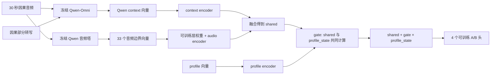
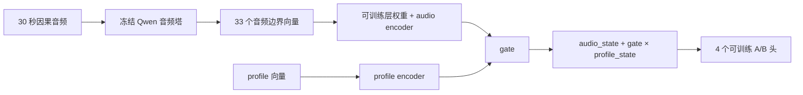
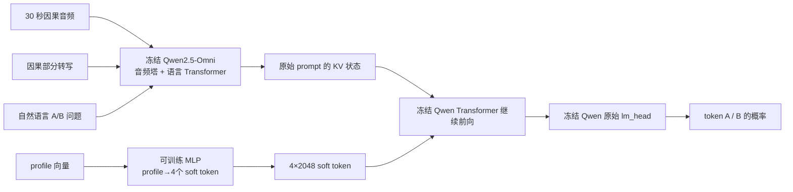

# Qwen turn-taking 三种结构

## 1. Qwen 音频塔到底是什么

它不是泛指“Qwen 模型”，而是 Qwen2.5-Omni Thinker 里面专门把波形音频编码成连续向量的子模块。

代码位置：`code/src/profile_turntaking/qwen_audio_layer_experiment.py`。

```python
from transformers import Qwen2_5OmniConfig, Qwen2_5OmniProcessor
from transformers.models.qwen2_5_omni.modeling_qwen2_5_omni import (
    Qwen2_5OmniAudioEncoder,
)

audio_config = full_config.thinker_config.audio_config
audio_tower = Qwen2_5OmniAudioEncoder(audio_config)
```

代码只从 Qwen 权重中读取键名以 `thinker.audio_tower.` 开头的权重。这个音频塔有卷积输入层和 32 个音频 Transformer 层；我们在预测边界从每层取最后一个因果音频帧，因此每条样本有 `33 × 1280` 的音频向量。

全 Qwen soft-prompt 路线使用的则是：

```python
from transformers import Qwen2_5OmniThinkerForConditionalGeneration
```

它包括音频塔、语言 Transformer 和 `lm_head`；此时 profile soft token 会进入语言 Transformer。

## 2. A：纯音频、无 profile 的 Talking Turns 对齐基线

```mermaid
flowchart LR
  A[预测点前 30 秒音频] --> B[Qwen2.5-OmniAudioEncoder<br/>冻结]
  B --> C[33 个边界向量<br/>33×1280]
  C --> D[可训练 softmax 层权重]
  D --> E[加权音频向量 1280]
  E --> F[Linear 1280→256<br/>GELU / LayerNorm]
  F --> G[4 个可训练 A/B 头]
  G --> H[Turn Change / BC / I / Floor-taking<br/>各输出 P(A), P(B)]
```

训练和测试都只有音频。这里没有 profile，因此 `hidden/given/shuffled` 三组必然完全相同；它只能作为音频能力基线，不能证明 profile。

## 3. B：音频＋因果转写＋profile 的 cached-feature adapter



训练时输入是 **音频＋因果转写＋profile**。测试三组中：

| 条件 | 音频 | 转写 | profile |
|---|---|---|---|
| hidden | 同一条 | 同一条 | 全零向量 |
| given | 同一条 | 同一条 | 正确 profile 向量 |
| shuffled | 同一条 | 同一条 | 其他会话的错误 profile 向量 |

因此这里真正在比较“只有 profile 改变，会不会改变结果”。

## 4. C：音频＋profile、无转写的 profile 消融



这是新补的必要消融：**三组都不输入转写**，但仍然有 profile 对照。

| 条件 | 音频 | 转写 | profile |
|---|---|---|---|
| hidden | 同一条 | 不输入 | 全零向量 |
| given | 同一条 | 不输入 | 正确 profile 向量 |
| shuffled | 同一条 | 不输入 | 错误 profile 向量 |

它回答的是：在不借助文字转写时，profile 是否仍能帮助音频话轮判断。它不能直接和纯音频 baseline 混在一起，因为它多了 profile。

## 5. D：真正进入 Qwen 的 soft-prompt adapter



训练时只更新 profile→soft-token MLP、基础 soft token 和任务 soft token；Qwen 所有参数冻结。关闭 adapter 时直接调用原始 Qwen，因此普通对话功能不受该 adapter 影响。

其 `hidden/given/shuffled` 原则和 B 完全相同：音频、转写、问题、预测点、解码设置不变，只换 soft token 的 profile 来源。
