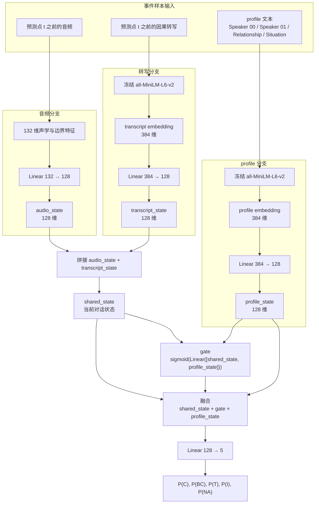
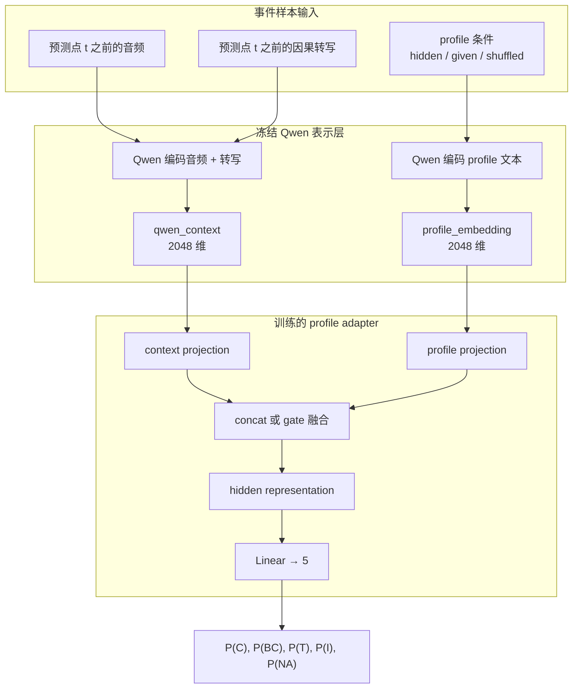
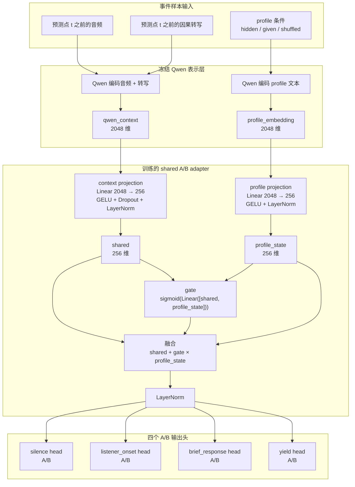
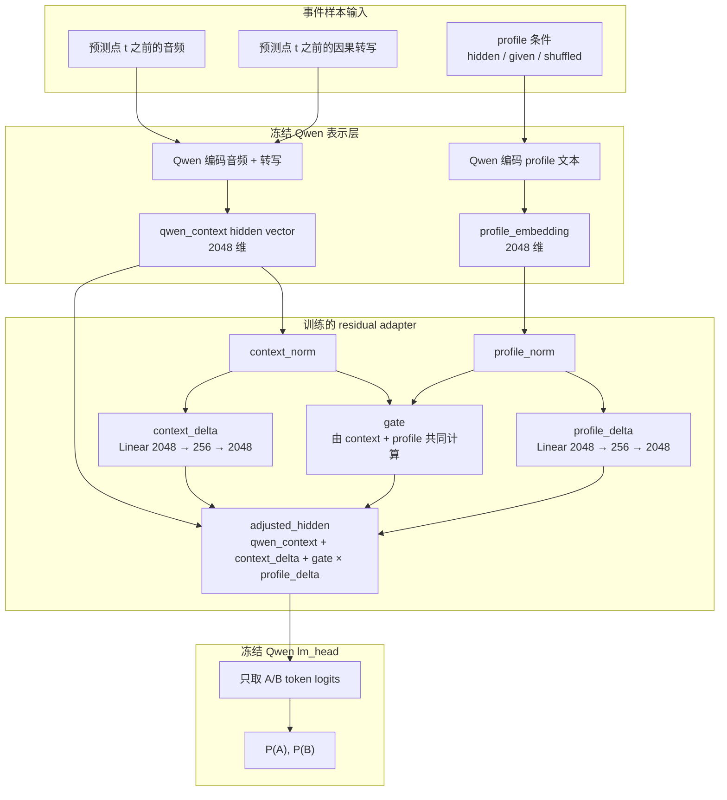

# 实验部分写法草稿：Profile-aware Turn-taking Prediction

> 这个版本不是按实验时间线写，而是按论文逻辑写：先定义同一个任务，再说明不同模型变体，最后统一报告结果。  
> 可作为论文中 “Experiments” 或 “Experimental Setup and Results” 部分的基础版本。

## 4. Experiments

### 4.1 Task Formulation

我们的目标是评估 profile 是否能够帮助模型判断下一步话轮事件。对每一个预测点 \(t\)，模型只能使用 \(t\) 之前的信息，包括预测点之前的音频、预测点之前的历史转写，以及当前实验条件下提供的 profile。模型不能看到未来音频、未来转写或目标标签。

每条样本的输入可以统一表示为：

```text
causal audio before t
+ causal transcript before t
+ profile condition
```

其中 profile condition 有三种：

| 条件 | 含义 | 作用 |
|---|---|---|
| hidden | 不提供 profile | 检查模型只看音频和转写时的表现 |
| given | 提供正确 profile | 检查正确 profile 是否能帮助预测 |
| shuffled | 提供错误匹配的 profile | 检查模型是否只是因为“多了一段文本/向量”而变化 |

在 hidden / given / shuffled 三组比较中，音频、转写、预测点、标签、prompt 模板和解码设置保持一致，唯一变化的是 profile 内容。这样可以把性能变化尽量归因到 profile，而不是归因到样本差异或输入格式差异。

我们使用两种输出形式。早期实验直接预测五类标签：

```text
C / BC / T / I / NA
```

其中 `C` 表示当前说话人继续说话，`BC` 表示听者短反馈，`T` 表示自然换人，`I` 表示打断或重叠进入，`NA` 表示无人说话或没有可判定话轮事件。

后续实验将任务拆成四个 A/B 二分问题：

| A/B 任务 | 判断内容 | 与五分类的关系 |
|---|---|---|
| silence | 接下来是否保持无人说话/无新事件 | 主要对应 `NA` |
| listener_onset | 听者是否开始说话 | 区分 `C` 与 `BC/T/I` |
| brief_response | 听者开始后，是否只是短反馈 | 区分 `BC` 与 `T/I` |
| yield | 新说话是否形成换人而不是打断 | 区分 `T` 与 `I` |

#### Why A/B formulation?

采用 A/B 任务不是为了改变研究问题，而是为了把同一个五分类问题拆成更可控的判断步骤。这个设计可以由 Talking Turns 的实验方式支撑。该论文在 “How Well Audio Foundation Models Predict Turn-Taking?” 中让 audio foundation model 只能看到当前点之前的音频，然后预测接下来会发生的话轮事件；在 Appendix A.5 中进一步说明，他们把 turn change、backchannel、interruption 和 floor-taking interruption 都构造成简单的 Yes/No 或 A/B 问题，并且正负样本均衡。因此，Table 4 中 random baseline 是 50%。

这对我们的实验有三个启发：

1. **任务形式更稳定。** 一次性要求模型从 `C / BC / T / I / NA` 五类里选一个，容易出现输出塌缩；拆成 A/B 后，每一步只判断一个具体问题。
2. **结果更容易解释。** 如果模型错了，我们可以知道它是没有判断出“听者是否开始说话”，还是没有区分“短反馈”和“正式接话”，而不是只得到一个五分类错误。
3. **方便和已有工作对齐。** Talking Turns 的 Table 13 和 Table 14 中，模型也是被要求在两个选项之间回答，例如当前说话人继续还是第二个说话人开始、是否会产生 backchannel、是否会发生 interruption、重叠是否会成功取得话轮。我们的 A/B 任务沿用了这种“预测下一个局部话轮决策”的思想，但加入了 profile 条件。

因此，A/B 版本不是另一个无关任务，而是五分类 turn-taking prediction 的层次化实现。最终可以把四个二分判断组合回对 `C / BC / T / I / NA` 的理解。

### 4.2 Dataset and Profile Construction

实验基于 SBCSAE 双人会话数据。每条样本由一个预测点 \(t\) 构成，包含：

```text
sample_id
session_id
prediction_time
audio segment before prediction_time
causal transcript before prediction_time
speaker activity around prediction_time
profile text
target label
```

profile 使用固定模板组织为自然语言文本：

```text
Speaker 00: ...
Speaker 01: ...
Relationship: ...
Situation: ...
```

当前阶段的 profile 是静态 profile，主要包括说话人基本信息、关系和对话场景。后续动态版本可以在相同接口下更新 `relationship` 和 `situation`，或加入语速、停顿、情绪和历史反应等动态状态。

### 4.3 Compared Systems

为了避免把实验写成零散流水账，我们将所有实验整理为同一任务下的模型变体。它们的输入目标一致，区别主要在于 profile 是如何进入模型的。

| 系统 | 编码器/基础模型 | profile 表示方式 | 融合方式 | 输出 | 训练方式 | 论文中的定位 |
|---|---|---|---|---|---|---|
| Qwen prompt 5-way | Qwen2.5-Omni-3B Q4_K_M | profile 直接写入 prompt | 由 Qwen 自行理解 | 五分类标签 | 不训练 | zero-shot prompt baseline |
| MiniLM embedding 5-way | 音频统计特征 + MiniLM | MiniLM profile 向量 | MLP + gate | 五分类概率 | 训练小分类器 | 非 Qwen embedding 诊断 |
| Qwen 5-way adapter | 冻结 Qwen hidden/context vector | Qwen profile embedding | profile adapter | 五分类概率 | 只训练 adapter | Qwen embedding 早期版本 |
| Qwen A/B prompt | Qwen2.5-Omni-3B Q4_K_M | profile 直接写入 prompt | 由 Qwen 自行理解 | 四个 A/B 判断 | 不训练 | 与二分任务对齐的 prompt baseline |
| Qwen shared A/B adapter | 冻结 Qwen 作为特征提取器 | Qwen profile embedding | context/profile 融合后接我们自己的二分类头 | 四个 A/B 概率 | 四个任务共享一个 adapter | 主模型 |
| Qwen LM-head A/B adapter | 冻结 Qwen hidden vector + 冻结 Qwen lm_head | Qwen profile embedding | 在 Qwen hidden space 里做 residual 调整 | Qwen 原生 A/B token 概率 | 每个 A/B 任务单独训练 adapter | 补充模型 |

主文结果表中保留所有模型变体，保证实验链条完整；讨论时重点放在 Qwen prompt baseline、Qwen shared A/B adapter 和 Qwen LM-head A/B adapter。MiniLM embedding 与 Qwen 五分类 adapter 主要用于说明为什么最终采用 A/B profile adapter 结构。

两个 Qwen A/B adapter 的关键区别如下：

| 对比点 | Qwen shared A/B adapter，B 路线 | Qwen LM-head A/B adapter，A 路线 |
|---|---|---|
| Qwen 的作用 | Qwen 只负责把“音频+转写”和 profile 编成向量 | Qwen 负责提供 hidden vector，并且最后仍使用 Qwen 自己的 A/B token 输出头 |
| profile 怎么起作用 | profile embedding 与 context embedding 融合，得到一个新的判断向量 | profile embedding 生成一个 residual adjustment，直接调整 Qwen hidden vector |
| 最后谁输出 A/B | 我们训练的 `Linear 256 → 2` 二分类头输出 A/B 概率 | 冻结的 Qwen `lm_head` 用 A/B token 权重输出概率 |
| 四个任务怎么训练 | 一个共享 adapter 同时服务 `silence / listener_onset / brief_response / yield`，最后接四个小 head | 每个 A/B 任务单独训练一套 adapter，因为不同问题的 A/B 语义方向不同 |
| 优点 | 结构简单、稳定、容易作为主方法汇报 | 更接近“让 Qwen 自己回答 A/B”，说明 profile adjustment 可以接到 Qwen 原生输出空间 |
| 缺点 | 最后输出头是我们训练的，不是 Qwen 原生语言头 | 结构更复杂，训练成本和解释成本更高 |

换句话说，B 路线是“用 Qwen 做表示，再训练一个共享 turn-taking judge”；A 路线是“在 Qwen 的 hidden space 里加入 profile 调整，再让 Qwen 原来的 A/B token head 打分”。所以 B 路线更适合做主结果，A 路线更适合说明这个方法不是只能接一个外部分类头，也可以接到 Qwen 自己的输出空间。

### 4.4 Unified Pipeline

所有 profile-aware 模型可以概括为以下流程：

```text
预测点 t 之前的音频
        ↓
音频/多模态编码
        ↓
context representation

预测点 t 之前的转写
        ↓
文本/多模态编码
        ↓
context representation

profile 文本
        ↓
profile embedding
        ↓
profile adapter

context representation + profile adapter
        ↓
turn-taking output head
        ↓
C / BC / T / I / NA
或四个 A/B 概率
```

也就是说，模型并不是单独根据 profile 做判断。profile 的作用是调整模型对同一段音频和同一段历史转写的判断。实验中 hidden / given / shuffled 三组的音频和转写完全相同，因此可以观察正确 profile 是否比无 profile 或错误 profile 更有帮助。

### 4.5 Model Details

#### Prompt baseline

Prompt baseline 直接把音频、历史转写和 profile 文本输入 Qwen2.5-Omni-3B，并要求模型输出标签或 A/B 选项。这个设置不训练任何参数，用来检查现成多模态大模型能否直接完成任务。

五分类 prompt 的输出格式为：

```json
{"label": "T"}
```

A/B prompt 的输出格式为：

```text
A
```

或：

```text
B
```

#### MiniLM embedding 5-way

MiniLM 版本是第一个 embedding 方向的 pilot。它不接 Qwen，也不是多模态大模型；它的作用是先用一个很轻的模型检查“把 profile 单独变成向量，再和音频/转写融合”这条路是否可行。

它的输入仍然是同一条事件样本：

```text
预测点 t 之前的音频
+ 预测点 t 之前的因果转写
+ profile 文本
→ 目标标签 C / BC / T / I / NA
```

具体结构如下：



这里的 MiniLM 只负责把转写和 profile 文本转成固定长度向量，MiniLM 本身不参与训练。训练的只有音频分支、转写投影、profile 投影、gate 和最后的五分类头。

这个实验的意义是：它把 profile 从 prompt 里拿出来，变成一个独立分支。这样我们可以观察 profile 作为向量输入时是否能影响分类器。它不是最终方法，因为它没有接入 Qwen 的音频/语言表示，也没有使用 A/B 输出形式；但它解释了后续 Qwen adapter 为什么继续采用“context branch + profile branch + gate”的结构。

#### Qwen 5-way adapter

Qwen 5-way adapter 是 MiniLM 之后的中间版本。它把 MiniLM 文本向量换成 Qwen 表示：Qwen 先读取预测点之前的音频和因果转写，得到 `qwen_context`；同时 Qwen 编码 profile 文本，得到 `profile_embedding`。Qwen 冻结，只训练后面的融合 adapter 和五分类头。

结构如下：



它和 MiniLM 的区别是：MiniLM 只把文本转成向量，音频部分依赖手工特征；Qwen 5-way adapter 则使用 Qwen 对音频、转写和 profile 的表示。它和 Qwen shared A/B adapter 的区别是：这里仍然直接输出五分类，所以输出形式更难，结果也没有稳定体现 profile 增益。

#### Qwen shared A/B adapter

这是当前主模型。Qwen 负责把因果音频和因果转写编码成 `qwen_context`，同时把 profile 文本编码成 `profile_embedding`。Qwen 参数冻结，只训练后面的轻量 adapter。

结构如下：



这里的 `shared` 表示模型从音频和转写中得到的当前对话状态，`profile_state` 表示 profile 信息，`gate` 表示模型在当前样本中允许 profile 影响判断的程度。最终预测不是只看 profile，而是在保留音频和转写判断的基础上，让 profile 对结果进行调整。

#### Qwen LM-head A/B adapter

这个版本更接近“让 Qwen 自己回答 A/B”。它不使用我们自己训练的 `Linear → 2` 输出头，而是把 Qwen hidden vector 调整后，仍然使用冻结的 Qwen `lm_head` 中 A/B token 权重计算概率。

结构如下：



它和 Qwen shared A/B adapter 的关键区别在最后一步：shared A/B adapter 使用我们自己训练的 `Linear → 2` head 输出 A/B；LM-head A/B adapter 不训练新的二分类头，而是调整 Qwen hidden vector 后，继续用 Qwen 原本的 `lm_head` 计算 A/B token 概率。它的优点是输出空间更贴近 Qwen 原本的语言建模头；缺点是结构更复杂，目前每个 A/B 任务单独训练一个 adapter。因此它更适合作为补充实验，而不是主方法。

### 4.6 External Reference: Talking Turns

近期工作 Talking Turns 在 Table 4 中测试了多种音频 foundation model 对未来 turn-taking event 的预测能力。该论文的设置是：模型看到前面若干音频 chunk，然后预测下一个 turn-taking event。附录 A.5 说明，预测 turn change、backchannel、interruption 和 floor-taking interruption 时，模型被要求回答简单的 Yes/No 或 A/B 问题，并且每个 benchmark 由正负样本组成，因此 random baseline 是 50%。这与我们的 A/B 任务形式相近，但数据集和具体标签定义并不完全相同，因此这里作为外部参考，而不是严格同数据集对比。

| 来源 | 模型 | Turn Change | Backchannel | Interruption | Floor-taking Interruption | 平均 |
|---|---|---:|---:|---:|---:|---:|
| Talking Turns Table 4 | Random Baseline | 50.0 | 50.0 | 50.0 | 50.0 | 50.0 |
| Talking Turns Table 4 | Supervised Topline | 78.6 | 75.1 | 74.9 | 65.6 | 73.6 |
| Talking Turns Table 4 | SALMONN | 49.3 | 50.0 | 50.0 | 50.4 | 49.9 |
| Talking Turns Table 4 | Qwen2-Audio-Instruct | 46.5 | 49.3 | 51.5 | 54.4 | 50.4 |
| Talking Turns Table 4 | Qwen-AudioChat | 49.9 | 52.1 | 52.3 | 50.8 | 51.3 |
| Talking Turns Table 4 | Whisper+GPT-4o | 62.2 | 48.6 | 49.3 | 50.0 | 52.5 |

这个表的作用是提供背景和参照：在已有 benchmark 中，通用音频大模型直接做未来话轮事件预测时，很多结果接近 50% random baseline；而 supervised turn-taking model 可以明显高于随机水平。我们的实验沿用这种 A/B 预测思想，但加入 profile 条件，并比较 hidden / given / shuffled。后面主结果中，Qwen profile adapter 在我们自己的 SBCSAE profile setting 上达到约 68%–70% 平均 Accuracy，明显高于同设置下无 profile 条件，也高于 Talking Turns 中多数通用 audio FM 的随机附近表现。这里不是严格同数据集直接比较，而是说明：A/B turn-taking prediction 是已有工作认可的测试方式，并且 profile-aware adapter 能把结果从普通 prompt/无 profile 判断推进到更高的可用区间。

### 4.7 Main Results

下面把所有模型变体的结果放齐。五分类实验使用 Macro-F1 作为主指标；A/B 实验使用四个二分任务的平均 Accuracy 作为主指标。

| 系统 | 任务形式 | 主指标 | hidden | given | shuffled | given-hidden | given-shuffled |
|---|---|---|---:|---:|---:|---:|---:|
| Qwen prompt 5-way | 五分类 | Macro-F1 | 0.0868 | 0.0935 | 0.0907 | +0.0067 | +0.0028 |
| MiniLM embedding 5-way | 五分类 | Macro-F1 | 0.4037 | 0.4072 | 0.4048 | +0.0035 | +0.0024 |
| Qwen hidden 5-way adapter | 五分类 | Macro-F1 | 0.4197 | 0.4167 | 0.4051 | -0.0030 | +0.0116 |
| Qwen A/B prompt | 四个 A/B | Avg. Accuracy | 0.6767 | 0.6867 | 0.6817 | +0.0100 | +0.0050 |
| Qwen shared A/B adapter | 四个 A/B | Avg. Accuracy | 0.6512 | 0.6991 | 0.6917 | +0.0478 | +0.0074 |
| Qwen LM-head A/B adapter | 四个 A/B | Avg. Accuracy | 0.5585 | 0.6833 | 0.6736 | +0.1248 | +0.0098 |

这个总表的读法是：早期五分类实验主要说明直接 prompt 不稳定，而 embedding/adapter 可以让模型不再塌缩；后期 A/B 实验是主线结果，其中两个 Qwen profile adapter 都显示 `given > hidden` 且 `given > shuffled`。因此，真正用于支撑 profile 有效性的主结果是后两行。

#### Prompt 5-way baseline

直接五分类 prompt 的结果如下：

| 条件 | Macro-F1 | Balanced Accuracy | Accuracy | 预测分布 |
|---|---:|---:|---:|---|
| hidden | 0.0868 | 0.1960 | 0.1960 | C=0, BC=0, T=226, I=24, NA=0 |
| given | 0.0935 | 0.2120 | 0.2120 | C=0, BC=0, T=236, I=14, NA=0 |
| shuffled | 0.0907 | 0.2040 | 0.2040 | C=0, BC=0, T=236, I=14, NA=0 |

这个结果主要说明，直接让本地 Qwen 输出五分类标签时，模型容易集中输出少数类别。因此后续实验改用更可控的 A/B 任务形式。

#### MiniLM embedding 5-way

MiniLM embedding 版本的结果如下：

| profile 条件 | Macro-F1 | Balanced Accuracy | Log Loss | Brier Score |
|---|---:|---:|---:|---:|
| hidden | 0.4037 | 0.4107 | 1.5541 | 0.7625 |
| given | 0.4072 | 0.4173 | 1.5460 | 0.7566 |
| shuffled | 0.4048 | 0.4160 | 1.5466 | 0.7569 |

这个结果说明，把 profile 作为 embedding 单独输入后，模型比直接 prompt 五分类稳定很多，不再只输出少数类别。given 比 hidden 和 shuffled 略高，但提升很小，因此它更适合作为 embedding 方向的中间验证，而不是最终主证据。

#### Qwen hidden 5-way adapter

Qwen hidden 5-way adapter 的代表配置结果如下。这里使用 `adapter_concat_pdrop000`，表格形式与 MiniLM embedding 版本保持一致。

| profile 条件 | Macro-F1 | Balanced Accuracy | Log Loss | Brier Score | ECE |
|---|---:|---:|---:|---:|---:|
| hidden | 0.4197 | 0.4280 | 2.2724 | 0.9159 | 0.3892 |
| given | 0.4167 | 0.4213 | 1.9888 | 0.8740 | 0.3392 |
| shuffled | 0.4051 | 0.4093 | 1.9206 | 0.8675 | 0.3500 |

这个实验把 MiniLM 换成 Qwen hidden/context 表示。结果比直接 prompt 五分类稳定，不再出现严重输出塌缩；但 given 没有稳定超过 hidden。因此它说明 Qwen embedding adapter 方向可行，但五分类输出形式仍然不够理想，后续才改成 A/B 任务。

#### A/B prompt baseline

将任务改成四个 A/B 判断后，prompt-only 的结果如下：

| profile 条件 | silence | listener_onset | brief_response | yield | 平均 |
|---|---:|---:|---:|---:|---:|
| hidden | 0.8000 | 0.7500 | 0.6667 | 0.4900 | 0.6767 |
| given | 0.8000 | 0.7500 | 0.6667 | 0.5300 | 0.6867 |
| shuffled | 0.8000 | 0.7500 | 0.6667 | 0.5100 | 0.6817 |
| given-hidden | +0.0000 | +0.0000 | +0.0000 | +0.0400 | +0.0100 |
| given-shuffled | +0.0000 | +0.0000 | +0.0000 | +0.0200 | +0.0050 |

#### Qwen shared A/B adapter

Qwen shared A/B adapter 的结果如下：

| profile 条件 | silence | listener_onset | brief_response | yield | 平均 |
|---|---:|---:|---:|---:|---:|
| hidden | 0.6200 | 0.6850 | 0.5200 | 0.7800 | 0.6512 |
| given | 0.7080 | 0.7350 | 0.5533 | 0.8000 | 0.6991 |
| shuffled | 0.7000 | 0.7300 | 0.5467 | 0.7900 | 0.6917 |
| given-hidden | +0.0880 | +0.0500 | +0.0333 | +0.0200 | +0.0478 |
| given-shuffled | +0.0080 | +0.0050 | +0.0067 | +0.0100 | +0.0074 |

#### Qwen LM-head A/B adapter

Qwen LM-head A/B adapter 的结果如下：

| profile 条件 | silence | listener_onset | brief_response | yield | 平均 |
|---|---:|---:|---:|---:|---:|
| hidden | 0.5040 | 0.5100 | 0.5600 | 0.6600 | 0.5585 |
| given | 0.6800 | 0.6800 | 0.6333 | 0.7400 | 0.6833 |
| shuffled | 0.6760 | 0.6750 | 0.6133 | 0.7300 | 0.6736 |
| given-hidden | +0.1760 | +0.1700 | +0.0733 | +0.0800 | +0.1248 |
| given-shuffled | +0.0040 | +0.0050 | +0.0200 | +0.0100 | +0.0098 |

### 4.8 Summary of Experimental Design

整体实验设计可以概括为三层：

1. **任务层**：所有模型都在同一批事件上做下一步 turn-taking prediction，并严格使用预测点之前的信息。
2. **profile 控制层**：通过 hidden / given / shuffled 三种条件，固定音频和转写，只改变 profile。
3. **结构层**：比较 profile 作为 prompt 输入、作为独立 embedding 输入、以及作为 Qwen hidden-space adapter 输入时的差异。

因此，论文主文不需要强调“我们做了很多次实验”，而应该强调：我们在一个统一实验框架下比较了不同 profile 接入方式。早期五分类实验用于说明直接 prompt 的困难，后期 A/B adapter 实验用于呈现主要结果。
