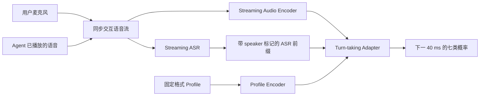

# 面向说话人社会身份的语音话轮预测：研究思路与初步实验

> 当前阶段目标：先验证一个最基础的猜想。在相同的局部对话条件下，把数据集已经给出的固定格式 profile 加入模型，能否提高下一话轮事件的预测准确性。初步实验只做预测，不要求模型自己猜 profile，也不直接评价完整语音助手的用户体验。

## 1. Introduction

自然对话需要参与者不断判断什么时候继续听、什么时候接话、什么时候给出简短回应，以及什么时候可以在对方尚未完全说完时进入话轮。这个判断发生得很快。说话者的停顿可能表示一句话已经结束，也可能表示仍在组织语言；一段重叠语音可能是在争夺话轮，也可能只是表示理解和支持。语音助手如果只在检测到固定时长的静音后回复，容易出现抢话、等待过久和缺少反馈等问题。

近年来的语音基础模型已经开始直接处理这些话轮现象。Talking Turns 将连续对话划分为很短的时间片，并预测五类事件：说话人继续发言、听者给出 backchannel、发生话轮转换、发生打断，以及无人说话。该研究进一步用人类对话训练出的预测器评价语音系统，发现现有系统仍会错过接话时机、过度打断或很少给出 backchannel。这说明话轮管理不仅需要听懂文字内容，还需要对对话正在如何展开作出连续判断（Arora et al., 2025）。

人类对话中的时间规则同时受到社会环境影响。跨语言研究发现，不同语言社群的话轮间隔存在稳定差异（Stivers et al., 2009）。对朋友和陌生人的研究还发现，同样的长停顿在陌生人对话中更容易被理解为尴尬，在朋友对话中却可能给双方留下共同思考和享受沉默的空间（Templeton et al., 2023）。医疗会话研究也表明，打断与说话人的角色、地位、发言类型和性别等因素共同相关，其作用方向随场景变化（Irish and Hall, 1995）。由此可以推测，人们判断是否接话时，会利用对交谈对象及双方关系的认识，而不只依赖当前几秒钟的声音。

本文将 **profile** 写成一份固定格式的说话人资料。每位说话人的部分只保留年龄段、数据集中记录的性别、职业或社会角色、社会背景等相对稳定的信息；整段会话再保留一个 `relationship` 和一个 `situation` 字段。数据集没有提供的内容统一写成 `unknown`，不要求模型补齐。模型仍然接收原始局部语音和转写，本研究单独控制的变量是是否加入这份 profile。

已有工作为这一方向提供了三个相邻的基础。PAChat 证明语音模型可以同时利用语义特征、说话人特征、对话历史和预先给定的用户 profile，生成符合特定人物信息的回复（Fu et al., 2025）。面向老年人的 Barge-in Agent 展示了完整的执行框架：系统分别处理接话、打断内容生成、相关性检查、用户打断和 backchannel，但其中的等待时间与触发频率主要依赖人工参数、规则和概率（Liu et al., 2025）。Talking Turns 给出了可复现的话轮标签和时间点评价方法，但没有把说话人的社会身份加入预测。三项工作分别覆盖了 profile 使用、行为执行和话轮评价，尚未形成一个能够检验 profile 是否帮助话轮预测的统一框架。

基于这一缺口，当前首先研究一个清楚的问题：在当前局部语音完全相同的情况下，加入数据集已经给出的 profile，模型能否更准确地预测下一个话轮事件？如果这个结果成立，第二步再研究模型能否根据更长的历史更新 `relationship` 和 `situation`。

第一轮采用一条直接的路径：数据集根据 speaker ID 把 profile 交给 Speaker A/B，模型把 profile、局部语音和转写放在一起，输出下一时刻的事件标签。整个模型只训练这个五分类任务。实验成立时，后续可以将预测结果接入 Barge-in Agent 一类控制器，决定继续听、给出 backchannel、接话或启动候选打断。本文当前的结论范围限于“profile 是否提高了人类话轮事件的预测”，完整系统是否让用户感觉更自然，需要在后续交互实验中单独验证。

## 2. 概念和任务定义

### 2.1 Profile 的固定格式

第一版只使用下面六类栏目，不为不同数据集反复改变结构：

| 栏目 | 内容 | 是否更新 |
| --- | --- | --- |
| `speaker_A.age_group` | Speaker A 的年龄段 | 不更新 |
| `speaker_A.gender` | 数据集中记录的性别 | 不更新 |
| `speaker_A.social_role` | 职业、会议角色或其他社会角色 | 不更新 |
| `speaker_A.background` | 教育、语言或地区背景，数据集有哪项就写哪项 | 不更新 |
| Speaker B 的同四项 | Speaker B 的相同资料 | 不更新 |
| `relationship` | 双方关系，用一个简短标签表示 | 后续可从 `unknown` 更新 |
| `situation` | 当前交谈场景，用一个简短标签表示 | 可以随对话阶段更新 |

数据集没有某个字段时直接写 `unknown`。例如：

```yaml
speaker_A:
  age_group: 45-59
  gender: female
  social_role: doctor
  background: unknown
speaker_B:
  age_group: 20-29
  gender: female
  social_role: patient
  background: college_student
relationship: first_meeting
situation: medical_consultation
```

这里“固定”的是格式，也包括年龄、性别、社会角色和背景在一段会话中不改变。`relationship` 通常也不会真的突然变化，但系统可能从一开始的 `unknown` 逐渐知道双方是什么关系；`situation` 则可能随着当前活动变化。第一轮实验直接使用数据集给出的值，不做这两个字段的自动更新。

在 CALLHOME 中，`situation` 基本都是日常电话聊天，因此这一字段在第一轮不会带来区分信息。它先保留在统一格式里，动态 situation 的作用要等后续加入会议、咨询等不同场景，或对长会话分段标注后再检验。

### 2.2 模型预测什么

初步实验沿用 Talking Turns 的五类标签：

| 标签 | 含义 | 后续系统中的候选行为 |
| --- | --- | --- |
| `C` / Continuation | 当前说话人将继续说 | 继续听 |
| `BC` / Backchannel | 听者将给出简短反馈 | 候选 backchannel，如“嗯”“对” |
| `T` / Turn change | 话轮将转给另一方 | 候选接话 |
| `I` / Interruption | 双方重叠，听者试图取得话轮 | 候选打断，仍需内容和相关性检查 |
| `NA` / Silence | 当前无人说话 | 等待或进入静默处理 |

`I` 标签描述人类语料中发生的事件。它本身不等于“语音助手此刻一定应该打断”。真正执行前仍需判断打断是合作性的还是竞争性的，并通过 Barge-in Agent 中的相关性检查和内容生成模块。

### 2.3 一条实验数据长什么样

每个测试点只需要三部分：

| 数据部分 | 内容 |
| --- | --- |
| 局部语境 `X_t` | 测试点之前固定 30 秒的双方语音和转写 |
| 固定格式 profile `P` | 已经按 speaker ID 对应好的 A/B 资料、`relationship` 和 `situation` |
| 真实标签 `y_t` | 下一 40 ms 实际发生的 `C/BC/T/I/NA` |

模型只完成一件事：根据 `X_t + P` 预测 `y_t`。为了公平比较，有 profile 和没有 profile 的测试条件使用完全相同的 `X_t`。

## 3. 第一个实验的具体架构

### 3.1 模型要完成什么

第一个实验训练一个 **profile-conditioned turn-taking adapter**。它不负责生成回复，也不直接控制 TTS；它持续观察当前对话，结合固定 profile，预测下一时刻最可能发生哪一种话轮事件。第一实验的七类输出为：

```text
C / BC / T / PAUSE / GAP / I_COOP / I_COMP
```

这里的 adapter 是接在已有语音编码器和 ASR 后面的一个小型可训练模块。基础模型负责把语音和文字转换成表示，adapter 负责把这些表示与 profile 结合，并输出话轮概率。第一实验可以先冻结基础语音模型和 ASR，只训练 profile encoder、融合层和分类头。

### 3.2 用户输入与系统内部输入

用户实际使用系统时只需要说话。模型所需的 ASR 文本由系统根据同一段语音自动产生，不是用户额外提供的输入。

在时间点 `t`，adapter 使用三类信息：

| 输入 | 内容 | 作用 |
| --- | --- | --- |
| 滚动语音窗口 `A_t` | `t` 之前约 30 秒的用户语音和 agent 播放记录 | 保留语速、停顿、重叠、音量和韵律 |
| ASR 前缀 `Z_t` | Streaming ASR 在 `t` 之前已经输出的文字，并带 A/B speaker 标记 | 提供当前内容和语义 |
| 固定 profile `P` | A/B 的年龄段、社会角色、背景、relationship 和 situation | 提供社会身份和场景信息 |

音频是必需信息；ASR 是辅助信息。系统不能等待一句话完全识别以后再预测话轮，因此 adapter 始终使用“当前已经得到的最后一版 ASR 文本”。ASR 暂时没有产生新词时，音频分支仍然可以继续更新话轮概率。

训练时也遵守同样的时间边界。人工转写只用于制作标签和检查 ASR，不作为模型在测试时能够提前看到的答案。模型输入中的文字应由 streaming ASR 生成，并且只能包含预测点之前已经输出的部分。

### 3.3 Adapter 的输入输出 Pipeline



在真实 user-agent 对话中，用户麦克风和 agent 自己播放的语音天然可以保留为两个同步流。在人类对话训练数据中，speaker diarization 和时间戳先把转写标成 Speaker A/B，再将相应 profile 放到正确说话人名下。因此，人物对应在数据预处理阶段完成，不需要在第一实验中另外训练人物匹配模块。

一个最小实现可以写成：

```text
audio_state   = AudioEncoder(A_t)
text_state    = TextEncoder(Z_t)
profile_state = ProfileEncoder(P)
hidden_state  = Adapter(audio_state, text_state, profile_state)
probability   = Softmax(Classifier(hidden_state))
```

Profile 在一段会话中只编码一次并缓存；音频和 ASR 状态随着新语音到来增量更新。实际部署时不需要每 40 ms 重新编码完整 30 秒音频，可以利用 streaming encoder 的历史缓存，只计算新到达的音频帧。

### 3.4 七类输出怎样进入真实交互

第一实验评价的是“模型能否预测人类接下来会发生的事件”。真实语音 agent 使用这些概率时，还需要一个行为控制层：

| Adapter 输出 | 行为控制层的候选处理 |
| --- | --- |
| `C`、`PAUSE` | 继续听，保持等待 |
| `GAP`、`T` | 允许 Main Agent 开始回复 |
| `BC` | 触发简短 backchannel 候选 |
| `I_COOP` | 生成简短补全或澄清候选，并进行相关性检查 |
| `I_COMP` | 不主动模仿竞争性抢话；用户打断 agent 时判断是否停止 TTS |

`I_COOP/I_COMP` 有一个需要明确的实时边界：在打断内容尚未说出之前，模型只能根据当前上下文预测某类打断发生的可能性，不能提前知道未来句子的完整意图。因此，真实系统采用两步处理。Adapter 先判断时间点是否接近 interruption；如果是 agent 主动打断，系统在播放前检查自己准备生成的候选内容；如果是用户打断，系统在获得用户的部分 ASR 后再确认其功能。第一个实验的七分类可以验证 profile 是否帮助这种预测，但完整交互仍需要 Barge-in Agent 中的内容生成与相关性检查模块。

### 3.5 后续的动态更新

第二阶段再增加低频更新模块。它读取更长的历史，只更新固定格式中的 `relationship` 和 `situation`：

```text
较长对话历史 -> Profile Updater -> relationship、situation
```

年龄段、数据集中记录的性别、社会角色和背景在会话中保持不变。更新后的两个字段重新编码并写入 adapter 缓存，话轮预测结构不需要改变。

### 3.6 架构可行性

该架构可以用于第一个可行性实验。Audio Encoder 提供时间和声音线索，Streaming ASR 提供语义，固定 profile 是唯一新增条件，adapter 的训练范围较小，也符合真实语音系统的输入方式。需要保留的限制是：七分类预测本身不能直接保证交互体验更好，尤其不能仅凭一个 `I_COOP` 概率就立即打断用户。第一实验首先验证 profile 是否提高人类话轮预测，行为收益再通过后续在线交互实验验证。

## 4. 第一实验数据集

### 4.1 数据来源

第一实验使用 **Santa Barbara Corpus of Spoken American English（SBCSAE）**。该语料包含 60 段连续自然语音、人工转写、说话人时间戳和人口统计资料。说话人资料包括年龄、数据集中记录的性别、教育、职业和地区背景；会话说明提供人物关系和交谈场景。语料覆盖家庭聊天、朋友交谈、电话、辅导、商务、销售、医疗、工作会议和公共机构交流等环境。语料、metadata 和音频入口由 [UCSB 官方页面](https://www.linguistics.ucsb.edu/research/santa-barbara-corpus-spoken-american-english) 提供。

### 4.2 样本范围与 Profile 制作

SBCSAE 同时包含双人和多人会话。第一实验从全部 60 段录音中抽取 **滚动 30 秒内只有两位具名说话人参与** 的窗口。语料中有 14 段完全双人的录音，共约 5.52 小时，可直接作为核心数据；多人会话中符合双人条件的窗口也可以保留。窗口内出现第三位说话人时，该窗口不进入第一实验。

模型使用的 profile 从原始资料整理为固定格式：

| Profile 字段 | SBCSAE 来源 |
| --- | --- |
| `age_group` | metadata 中的年龄 |
| `gender` | metadata 中记录的性别 |
| `social_role` | 职业、家庭角色或当前制度性角色 |
| `background` | 教育和地区背景 |
| `relationship` | 会话说明和 CHAT comment 中的人物关系 |
| `situation` | 会话说明中的交谈场景 |

缺失字段统一记为 `unknown`。姓名和 speaker ID 只用于连接语音、转写和 metadata，不进入模型看到的 profile。会话说明先按固定标签整理，再由人工逐段确认。训练集、验证集和测试集按说话人划分，避免同一个人的声音或 profile 同时出现在训练和测试中。

### 4.3 七类标签制作

SBCSAE 原始数据没有现成的七类话轮标签，需要按以下流程补充：

1. 对原始音频运行 VAD 和 speaker diarization，得到每 40 ms 的说话活动。
2. 使用 CHAT/TRN 的 speaker ID 和时间戳，把 diarization 轨道对应到具体人物并修正边界。
3. 根据说话活动自动生成 `C`、`T`、`PAUSE`、`GAP` 和重叠候选，结合转写找出 `BC` 候选。
4. 将重叠候选交给 AI 预标，并由人工确认 `I_COOP` 或 `I_COMP`。笑声、背景声、齐声朗读和无法判断的重叠不进入七分类 gold set。
5. 训练切点按类别平衡抽样；验证集和测试集保留自然分布，并报告每一类的结果。

SBCSAE 的时间戳对应 intonation unit，而不是逐帧 VAD。一个 intonation unit 内部仍可能包含停顿，因此时间戳可以帮助恢复说话人切换和显式重叠，但 `PAUSE/GAP` 必须根据原始音频重新检测。

### 4.4 已完成的数据检查

时间戳转标签程序先在 CALLHOME 公开样例上完成验证：58 条转写被转换为 2,112 个 40 ms 帧和 135 个连续事件。该样例只用于检查程序，不属于第一实验数据。

同一程序已经在 SBCSAE 的 `SBC001` 上运行：1,310 条转写单元被转换为 37,883 个 40 ms 帧和 428 个连续事件。说话人切换和显式重叠能够从时间戳恢复，但仅检测到 37 个静音帧，说明正式制作 `PAUSE/GAP` 时必须加入音频 VAD。程序对未完成语义判断的重叠统一输出 `I_REVIEW`，不会直接将其当作 `I_COOP` 或 `I_COMP`。

### 4.5 可行性结论

SBCSAE 可以用于第一实验。它同时提供连续自然语音、可验证的个人 profile、人物关系和多种交谈场景，数据结构能够支持 profile-conditioned turn-taking 预测。当前主要工作量集中在音频 VAD、speaker diarization 和 interruption 语义标注，而不是重新采集对话。

该语料更适合验证方法是否成立，而不是单独支撑一个大规模通用模型。它只有 60 段录音，严格双人核心约 5.52 小时，`I_COOP/I_COMP` 的数量和人工一致性仍需在完整标注后统计。因此，第一实验可以用它回答“profile 是否带来稳定增益”，但结果的跨语言、跨文化和大规模泛化需要后续数据验证。

## 5. 第一个训练实验：Profile-aware 下一话轮预测

### 5.1 一条训练数据必须包含什么

| 字段 | 内容 | 是否作为答案 |
| --- | --- | --- |
| `local_audio_A/B` | 当前切点之前固定 30 秒的双方语音 | 输入 |
| `local_transcript` | 同一段带 speaker 和起止时间的转写 | 输入 |
| `profile` | 已经对应好 A/B 的固定格式资料，以及 `relationship`、`situation` | 输入 |
| `turn_label` | 下一 40 ms 的 `C/BC/T/I/NA` | 最终答案 |

一个简化样本可以表示为：

```json
{
  "local_audio_A": "A_last_30_seconds.wav",
  "local_audio_B": "B_last_30_seconds.wav",
  "local_transcript": "[A 12.1-14.6] ... [B 14.8-15.2] ...",
  "profile": {
    "speaker_A": {"age_group": "45-59", "gender": "female", "social_role": "doctor", "background": "unknown"},
    "speaker_B": {"age_group": "20-29", "gender": "female", "social_role": "patient", "background": "college_student"},
    "relationship": "first_meeting",
    "situation": "medical_consultation"
  },
  "turn_label": "T"
}
```

数据预处理时利用数据集的 speaker ID 完成人物对应，生成样本后不再保留候选 profile 或匹配答案。不同数据集缺少的 profile 栏目统一填 `unknown`，格式保持不变。

### 5.2 输入和输出

模型的最终输入是：

```text
当前切点之前固定 30 秒的双方语音
+ 同一段带说话人和时间戳的转写
+ 已经对应好的固定格式 profile
```

模型只产生一个输出：

```text
下一 40 ms 的 C / BC / T / I / NA 概率
```

### 5.3 训练一次，测试两种条件

为了只训练一次，又能比较 profile 是否有用，训练时随机把一部分样本的所有 profile 值改成 `unknown`。表格结构没有变化，只是内容被隐藏。模型因此同时见过“有 profile”和“没有 profile”两种输入。

训练完成后，用同一个 checkpoint 测试两种模式：

| 模式 | 做法 | 回答的问题 |
| --- | --- | --- |
| **Profile hidden** | 所有 profile 值设为 `unknown` | 只看当前对话能做到什么程度 |
| **Profile given** | 提供数据集中的正确 profile | 固定 profile 是否带来额外帮助 |

预期关系为：

```text
Profile given > Profile hidden
```

初步可行性阶段用同一个 checkpoint 完成这两个测试。结果成立后，正式论文再训练一个完全不接收 profile 的独立 baseline，作为更严格的复核。

### 5.4 Loss 怎么计算

第一轮只有一个 **话轮预测 loss**。正确答案是下一时刻的标签，例如真实答案为 `T`，模型给 `T` 的概率越低，惩罚越大：

```text
L_turn = CrossEntropy(predicted_turn_label, true_turn_label)
```

由于 `C` 和 `NA` 数量通常远多于 `BC` 和 `I`，这里使用带类别权重的 Cross Entropy，或按类别平衡抽样，防止模型只猜多数类。

最终就是：

```text
L_total = L_turn
```

第一轮只计算这一个 loss。观察训练结果时只需要看：

| 现象 | 说明 |
| --- | --- |
| 训练和验证 loss 都下降 | 五分类模型正常学习 |
| `Profile given` 优于 `Profile hidden` | 模型从固定 profile 得到了额外信息 |
| 两种输入没有差别 | profile 没有帮助，或模型没有使用它 |
| 训练 loss 下降但测试不升 | 可能记住说话人声音，需要检查按说话人划分 |

后续更新 `relationship` 和 `situation` 时，可以先用普通 MLLM 按固定格式输出两个字段，不与第一个实验联合训练。

## 6. 七类话轮标签和评测

### 6.1 主任务标签

第 2 节的五类定义用于复现 Talking Turns；第一实验的主任务将其中的 `I` 和 `NA` 展开为七类。第 5 节的分类器与 loss 形式保持不变，只把输出维度改为下面七类：

| 标签 | 标注定义 | 对语音 agent 的意义 |
| --- | --- | --- |
| `C` | 当前持有话轮的人继续发言 | 继续听，不抢话 |
| `BC` | 听者给出简短反馈，但没有取得话轮 | 可以给出“嗯”“对”等反馈 |
| `T` | 新说话人取得话轮的起始位置 | 开始正常接话 |
| `PAUSE` | 一段静音结束后仍由原说话人继续 | 等待，不把思考停顿当作结束 |
| `GAP` | 一段静音结束后由另一位说话人接话 | 话轮已经开放，可以回应 |
| `I_COOP` | 重叠发言用于补全、支持或澄清当前说话人的内容 | 允许候选合作性补充 |
| `I_COMP` | 重叠发言主要用于抢占话轮、反驳或改变当前话题 | 避免主动模仿，并在被打断时决定是否让出话轮 |

`PAUSE/GAP` 的 gold label 根据静音之后由谁继续说话确定；制作标签时可以查看完整事件，但模型输入仍严格截止到预测点之前。`T` 标在新说话人真正取得话轮的起始帧，之后的普通发言重新标为 `C`。

为了与 Talking Turns 比较，可以把 `I_COOP/I_COMP` 合并为 `I`，把 `PAUSE/GAP` 合并为 `NA`，得到原来的五分类结果。本文的主结果报告七分类，五分类只作为可比基线。

### 6.2 Interruption 的标注依据

[Talking Turns](https://openreview.net/pdf?id=2e4ECh0ikn) 将 `I` 定义为双方同时发声、且其中没有 backchannel 的重叠。论文进一步区分：如果后进入者在重叠结束后取得话轮，则为 floor-taking 或 successful interruption；如果原说话人继续持有话轮，则为 butting-in 或 unsuccessful interruption。这个标准只说明“谁最后拿到话轮”，没有标注打断是合作性的、竞争性的，或用户是否喜欢这次打断。

本实验依据打断内容的功能补充语义标签。分类体系采用以下五种细类：

| 细类 | 合并后的标签 |
| --- | --- |
| Sentence completion | `I_COOP` |
| Clarification / inquiry | `I_COOP` |
| Floor-taking | `I_COMP` |
| Disagreement | `I_COMP` |
| Topic-changing | `I_COMP` |

这一分类与面向老年人的 Barge-in Agent 所使用的五种 interruption 类型一致。`I_COOP/I_COMP` 表示打断在对话中的功能，不直接等同于主观上的“好/坏”；真实舒适度需要后续用户实验评价。

具体标注流程如下：

1. 由 VAD 和 diarization 找出所有非 backchannel 的重叠候选。
2. 排除笑声、噪声、齐声说话、正常语音拖尾和无法辨认的片段。
3. 向 AI 提供重叠前后各约 5 秒的音频、人工转写和双方 profile，让其输出五种细类之一，并指出对应文本证据。
4. 训练集可以使用 AI 预标结果并进行抽样人工检查；验证集和测试集中的所有 interruption 由两名人工标注者独立确认，分歧由第三人裁决。
5. 报告人工标注的一致性，例如 Cohen's kappa；无法达成一致的事件不进入七分类 gold set。

### 6.3 训练和评测指标

七分类头仍使用带类别权重的 Cross Entropy。主要结果比较同一个模型在 `Profile given` 和 `Profile hidden` 两种输入下的表现。

| 评测内容 | 指标 |
| --- | --- |
| 整体七分类 | Macro-F1、Balanced Accuracy |
| 每类行为 | 每类 Precision、Recall、F1 和混淆矩阵 |
| 事件时机 | 允许预测点与真实事件起点相差不超过 200 ms 的 event-level F1 |
| Profile 的作用 | `Profile given` 相对 `Profile hidden` 的 Macro-F1 与每类 F1 增量 |
| 打断细分 | `I_COOP/I_COMP` 的二分类 F1，以及人工标注一致性 |
| 与 Talking Turns 对比 | 合并后的五分类 Macro-F1 和每类 ROC-AUC |

重点观察 profile 是否提高 `PAUSE/GAP` 和 `I_COOP/I_COMP` 的区分，而不仅是提高数量最多的 `C`。数据划分、类别权重和 profile 替换实验保持一致；固定局部语音而替换 profile 后，模型只应在社会身份或场景确实相关的样本上发生明显变化。

#### 6.3.1 第一轮五分类主结果表

第一轮按照第 9 节的最小可行实验执行，以五分类作为主结果。同一个 checkpoint 在完全相同的测试样本上分别运行 `Profile hidden` 和 `Profile given`；两种条件只有 profile 内容不同。最终填写下面的结果表：

| 测试条件 | Macro-F1 | `C` F1 | `BC` F1 | `T` F1 | `I` F1 | `NA` F1 |
| --- | ---: | ---: | ---: | ---: | ---: | ---: |
| `Profile hidden` |  |  |  |  |  |  |
| `Profile given` |  |  |  |  |  |  |
| `Given - Hidden` |  |  |  |  |  |  |

每一类的 Precision、Recall 和 F1 使用下面的明细表报告：

| 测试条件 | 类别 | Precision | Recall | F1 |
| --- | --- | ---: | ---: | ---: |
| `Profile hidden` | `C` |  |  |  |
| `Profile hidden` | `BC` |  |  |  |
| `Profile hidden` | `T` |  |  |  |
| `Profile hidden` | `I` |  |  |  |
| `Profile hidden` | `NA` |  |  |  |
| `Profile given` | `C` |  |  |  |
| `Profile given` | `BC` |  |  |  |
| `Profile given` | `T` |  |  |  |
| `Profile given` | `I` |  |  |  |
| `Profile given` | `NA` |  |  |  |

此外生成两种条件各自的五分类混淆矩阵，用于检查 profile 主要减少了哪些类别之间的混淆。错误或随机打乱的 profile 作为负控制，结果单独填入下表：

| Profile 条件 | Macro-F1 | 相对 `Profile hidden` 的变化 | 解释 |
| --- | ---: | ---: | --- |
| `Profile hidden` |  |  | 无 profile 基线 |
| `Profile given` |  |  | 正确 profile 是否带来增益 |
| `Profile shuffled` |  |  | 错误 profile 是否损害预测，或模型是否忽略 profile |

#### 6.3.2 七分类诊断结果表

第一轮不要求为全部训练数据制作人工七分类 gold label。优先自动生成 `PAUSE/GAP`，并对 `I_COOP/I_COMP` 使用 AI 预标和少量人工复核，从 `I` 和 `NA` 中形成约 300 至 500 个七分类诊断样本。若某一类样本过少，应同时报告该类的实际样本数，不对其作强结论。

| 测试条件 | 七分类 Macro-F1 | `C` F1 | `BC` F1 | `T` F1 | `PAUSE` F1 | `GAP` F1 | `I_COOP` F1 | `I_COMP` F1 |
| --- | ---: | ---: | ---: | ---: | ---: | ---: | ---: | ---: |
| `Profile hidden` |  |  |  |  |  |  |  |  |
| `Profile given` |  |  |  |  |  |  |  |  |
| `Given - Hidden` |  |  |  |  |  |  |  |  |

| 七分类类别 | 测试样本数 | 自动标注数 | 人工复核数 | Precision | Recall | F1 |
| --- | ---: | ---: | ---: | ---: | ---: | ---: |
| `C` |  |  |  |  |  |  |
| `BC` |  |  |  |  |  |  |
| `T` |  |  |  |  |  |  |
| `PAUSE` |  |  |  |  |  |  |
| `GAP` |  |  |  |  |  |  |
| `I_COOP` |  |  |  |  |  |  |
| `I_COMP` |  |  |  |  |  |  |

#### 6.3.3 动态 Profile 与表示方式对照表

第二阶段只允许 Profile Updater 根据当前时间点之前的较长历史更新 `relationship` 和 `situation`。年龄段、数据集中记录的性别、社会角色和背景保持不变。Updater 统一输出带置信度和生效时间的结构化 profile snapshot；为了公平考察 profile 的编码方式，结构化条件直接对相同 snapshot 使用 field embedding，自然语言条件则将同一 snapshot 按固定模板序列化为自然语言。两种条件不得使用不同的 updater 输出。

先单独评价动态字段是否更新正确：

| Updater 条件 | `relationship` Macro-F1 | `situation` Macro-F1 | 两字段 Joint Accuracy | 无依据错误更新率 |
| --- | ---: | ---: | ---: | ---: |
| 始终 `unknown` |  |  |  |  |
| Dynamic predicted |  |  |  |  |
| Gold / Oracle |  |  |  |  |

再使用完全相同的音频、ASR、数据划分和 updater snapshot，对比结构化 field embedding 与自然语言 profile 表示：

| Profile 来源 | Profile 编码方式 | 五分类 Macro-F1 | 七分类 Macro-F1 | `BC` F1 | `PAUSE` F1 | `GAP` F1 | `I_COOP` F1 | `I_COMP` F1 |
| --- | --- | ---: | ---: | ---: | ---: | ---: | ---: | ---: |
| Hidden | 全部设为 `unknown` |  |  |  |  |  |  |  |
| Static gold | Structured field embedding |  |  |  |  |  |  |  |
| Static gold | 固定模板自然语言 |  |  |  |  |  |  |  |
| Dynamic predicted | Structured field embedding |  |  |  |  |  |  |  |
| Dynamic predicted | 固定模板自然语言 |  |  |  |  |  |  |  |
| Dynamic gold / Oracle | Structured field embedding |  |  |  |  |  |  |  |
| Dynamic gold / Oracle | 固定模板自然语言 |  |  |  |  |  |  |  |

动态条件下“固定模板自然语言”与“Structured field embedding”的差值回答表示方式是否影响动态 profile 的使用；`Dynamic predicted` 与 `Hidden` 的差值回答自动更新是否真正帮助话轮预测；`Dynamic gold / Oracle` 与 `Dynamic predicted` 的差距反映当前 Profile Updater 仍有多少改进空间。

## 7. 如何解释实验结果

| 结果 | 可以得到的判断 |
| --- | --- |
| `Profile given` 稳定优于 `Profile hidden` | 固定 profile 对下一话轮预测有额外帮助，核心猜想得到初步支持 |
| 只在 `BC` 或 `I` 上提高 | Profile 主要帮助社会含义较强的话轮事件，这是合理且值得继续验证的结果 |
| 两种条件没有差别 | 当前 profile、数据量或任务不足以提供额外信息，也可能是融合方式没有让模型使用 profile |
| 换成错误 profile 后性能反而不变 | 模型大概率忽略了 profile |
| 只有年龄或性别有效，角色和关系无效 | 需要检查语音泄漏、数据偏差和类别不平衡，暂时不能解释为社会规则 |

## 8. 目前能够证明到哪一步

如果加入 profile 后，模型预测的人类话轮标签更准确，可以说明 profile 为话轮判断提供了额外信息，也可以说明该信息能够被现有模型利用。这个结果还不能直接推出“真实语音助手更自然”，因为人类语料中发生的打断也可能令人不适，标签一致性衡量的是行为接近程度。

完整系统的下一阶段需要把预测概率接入行为控制器，再评价实际接话延迟、错误打断率、backchannel 时机、用户是否继续原话题，以及用户主观感受。Barge-in Agent 的模块可以直接作为这一阶段的执行框架：`BC` 进入 Backchannel Module，`T` 交给 Main Agent 接话，`I` 进入 Interrupting Module 并经过 Relevance Detection，用户打断系统时由 User-Initiated Barge-in Module 停止 TTS。

## 9. 最小可行实验

建议先从 100 至 200 段带 profile 的连续对话开始，按 Talking Turns 的规则自动生成约 20,000 至 50,000 个相对平衡的训练切点。每个切点只保存局部 30 秒双方语音、同段转写、已经对应好的固定格式 profile 和五类话轮标签。训练时先冻结 Whisper，只训练 profile 文本表示、简单融合层和五分类头。

模型只训练一次，loss 只有带类别权重的 `L_turn`。训练时随机隐藏部分 profile；测试时对同一个 checkpoint 分别运行 `Profile hidden` 和 `Profile given`。第一轮主结果使用五分类；再从 `I` 和 `NA` 中抽取约 300 至 500 个样本，人工复核成七分类诊断集。这个规模足以先判断 profile 是否带来稳定趋势，也能暴露标签生成和说话人泄漏等问题。

## 参考文献与数据来源

- Arora, S. et al. (2025). [Talking Turns: Benchmarking Audio Foundation Models on Turn-Taking Dynamics](https://arxiv.org/abs/2503.01174).
- Fu, D. et al. (2025). [PAChat: Persona-Aware Speech Assistant for Multi-party Dialogue](https://aclanthology.org/2025.emnlp-main.1492/).
- Liu, C. et al. (2025). [Toward Enabling Natural Conversation with Older Adults via the Design of LLM-Powered Voice Agents that Support Interruptions and Backchannels](https://doi.org/10.1145/3706598.3714228).
- Lu, J. et al. (2026). [A Survey of Full-Duplex Spoken Dialogue Systems: Architectural Hierarchy, Interaction Ontology, and Decision State Machine](https://arxiv.org/abs/2606.19453).
- Stivers, T. et al. (2009). [Universals and cultural variation in turn-taking in conversation](https://doi.org/10.1073/pnas.0903616106).
- Templeton, E. M. et al. (2023). [Long gaps between turns are awkward for strangers but not for friends](https://doi.org/10.1098/rstb.2021.0471).
- Beattie, G. W. (1981). [Interruption in conversational interaction, and its relation to the sex and status of the interactants](https://doi.org/10.1515/ling.1981.19.1-2.15).
- Irish, J. T., and Hall, J. A. (1995). [Interruptive patterns in medical visits: The effects of role, status and gender](https://doi.org/10.1016/0277-9536(94)00399-E).
- [Switchboard-1 Release 2, LDC97S62](https://catalog.ldc.upenn.edu/LDC97S62).
- Canavan, A. et al. (1997). [CALLHOME American English Speech](https://catalog.ldc.upenn.edu/LDC97S42).
- Katerenchuk, D. et al. (2018). [Interpersonal Relationship Labels for the CALLHOME Corpus](https://aclanthology.org/L18-1592/).
- [Santa Barbara Corpus of Spoken American English](https://www.linguistics.ucsb.edu/research/santa-barbara-corpus-spoken-american-english).
- [AMI Meeting Corpus](https://groups.inf.ed.ac.uk/ami/corpus/).
- Reece, A. et al. (2023). [The CANDOR corpus: Insights from a large multimodal dataset of naturalistic conversation](https://pmc.ncbi.nlm.nih.gov/articles/PMC10065445/).
- [PAChat / Persona-Dialogue project page](https://persona-dialogue.github.io/).
